# System Map

The config subsystem is a local desktop editor with two Python-driven surfaces sharing the same project files:

- `config/eg-config.pyw`: the full Tk editor.
- `config/launch-react-config.pyw` and `config/start-react-browser.cmd`: the React desktop shell over FastAPI.

There is no live service dependency from EG-TSX into the config editor. EG-TSX reads files from the repository directly.

```mermaid
graph TD
    Editor[Editor]

    subgraph Desktop["Config Desktop Surfaces"]
        TkLaunch[config/eg-config.pyw]
        TkApp[MegaConfig Tk shell]
        ReactLaunch[config/launch-react-config.pyw]
        BrowserLaunch[config/start-react-browser.cmd]
        Launcher[config/app/launcher.pyw]
        FastAPI[config/app/main.py + ConfigRuntime]
        ReactUI[config/ui/app.tsx]
        DesignTokens[config/ui/app.css tokens]
    end

    subgraph Shared["Shared Python Runtime"]
        Store[ConfigStore]
        Watcher[ConfigWatcher]
        Cache[DataCache]
    end

    subgraph Files["Project File Contracts"]
        Categories[categories.json]
        Content[content.json]
        HubTools[hub-tools.json]
        NavbarOrder[navbar-guide-sections.json]
        Slideshow[slideshow.json]
        ImageDefaults[image-defaults.json]
        AdsRegistry[ads-registry.json]
        InlineAds[inline-ads-config.json]
        Sponsors[direct-sponsors.json]
        CacheCdn[cache-cdn.json]
        Frontmatter[src/content frontmatter]
        Env[.env PUBLIC_ADS_ENABLED]
        Icons[public/images/navbar/*.svg]
        ContentTree[src/content plus data-products]
    end

    subgraph Site["EG-TSX Runtime Consumers"]
        CategoryCore[src/core/category-contract.ts and config/content/products readers]
        Home[src/pages/index.astro and home features]
        SiteIndex[src/features/site-index/*]
        HubRuntime[src/core/hub-tools.ts]
        GlobalNav[src/shared/layouts/GlobalNav.astro]
        AdsRuntime[src/features/ads/*]
        CacheRuntime[src/core/cache-cdn-contract.ts]
        Invalidation[scripts/invalidation-core.mjs]
    end

    Editor --> TkLaunch
    Editor --> ReactLaunch
    Editor --> BrowserLaunch

    TkLaunch --> TkApp
    TkApp --> Store
    TkApp --> Watcher
    TkApp --> Cache

    ReactLaunch --> Launcher
    BrowserLaunch --> FastAPI
    Launcher --> FastAPI
    FastAPI --> ReactUI
    DesignTokens --> ReactUI
    FastAPI --> Store
    FastAPI --> Cache

    Cache --> ContentTree
    TkApp --> Icons
    FastAPI --> Icons

    Store --> Categories
    Store --> Content
    Store --> HubTools
    Store --> NavbarOrder
    Store --> Slideshow
    Store --> ImageDefaults
    Store --> AdsRegistry
    Store --> InlineAds
    Store --> Sponsors
    Store --> CacheCdn

    TkApp --> Frontmatter
    TkApp --> Env

    Categories --> CategoryCore
    Categories --> GlobalNav
    Categories --> Home

    Content --> Home
    Content --> SiteIndex

    HubTools --> HubRuntime
    HubTools --> Home

    NavbarOrder --> GlobalNav
    Frontmatter --> GlobalNav
    Frontmatter --> SiteIndex

    Slideshow --> Home
    ImageDefaults --> Home
    ImageDefaults --> CategoryCore

    AdsRegistry --> AdsRuntime
    InlineAds --> AdsRuntime
    Env --> AdsRuntime

    CacheCdn --> CacheRuntime
    CacheCdn --> Invalidation
```

## Runtime Boundaries

- The Tk app reads and writes files directly through `ConfigStore`.
- The React shell reads and writes only through the local FastAPI app, which still persists through `ConfigStore`.
- `DataCache` is read-only and scans `src/content` plus `src/content/data-products`.
- The site runtime imports JSON contracts directly from `config/data` and reads content frontmatter through Astro content collections.

## React Design System Layer

The React shell has a strict two-layer design token system in `config/ui/app.css`:

- **Skin tokens** (themable): colors (Catppuccin Mocha palette), typography (families, weights, sizes, line heights, letter spacing), border radii, shadows, z-index. A future `html[data-theme="modern"]` block can reskin the entire app by overriding only these tokens.
- **Skeleton tokens** (locked): sidebar width, context/logo/nav/status bar heights, card grid gaps, internal padding, input/button/toggle dimensions. These control the data-dense layout grid and are not overridden by themes.

Fallback theme family is `legacy-clone-dark`: radii=0 (hard-locked),
shadows=none, Catppuccin Mocha colors. The active checked-in shell theme is
stored in `config/data/settings.json` and may use any supported
`<family>-<mode>` id.

All component CSS rules reference tokens — zero hardcoded skin values (colors, fonts, shadows, radii) in component rules. Structural spacing (gap, padding, margin) uses literal values since they are skeleton, not skin.

Sidebar nav icons are inline SVGs in `config/ui/app.tsx` (`NAV_ICONS` map) using `stroke="currentColor"` / `fill="currentColor"`. Theme changes to `--color-overlay-0` (inactive) or `--theme-site-primary` (active) automatically update every icon.

Full token reference: [Design Token Architecture](../frontend/design-token-architecture.md).

## Important Truths For Porting

- The React shell is not a second source of truth. It is a second UI over the same files.
- All 9 panels have a full React path: UI, API payload, save endpoint, and watch refresh.
- Navbar and Ads are not JSON-only features. A faithful port must preserve frontmatter writes and `.env` writes.
- `direct-sponsors.json` is still part of the editor surface, but no current site runtime reader was verified.
- New panels must follow the [How To Port A Tk Panel To React](../frontend/routing-and-gui.md#how-to-port-a-tk-panel-to-react) checklist.
- New components must use design tokens for all skin properties — see [Rules for new components](../frontend/routing-and-gui.md#rules-for-new-components).

## Cross-Links

- [Panel Interconnection Matrix](panel-interconnection-matrix.md) — cross-panel dependencies, live preview cascading, watch polling rules
- [Python Application](../runtime/python-application.md)
- [Environment and Config](../runtime/environment-and-config.md)
- [Data Contracts](../data/data-contracts.md)
- [Routing and GUI](../frontend/routing-and-gui.md)

## Validated Against

- `config/eg-config.pyw`
- `config/app/main.py`
- `config/app/runtime.py`
- `config/ui/app.tsx`
- `config/ui/app.css`
- `config/app/launcher.pyw`
- `config/launch-react-config.pyw`
- `config/start-react-browser.cmd`
- `config/scripts/start-browser.cmd`
- `config/lib/config_store.py`
- `config/lib/config_watcher.py`
- `config/lib/data_cache.py`
- `config/panels/navbar.py`
- `config/panels/ads.py`
- `src/core/category-contract.ts`
- `src/core/config.ts`
- `src/core/content.ts`
- `src/core/products.ts`
- `src/core/hub-tools.ts`
- `src/core/cache-cdn-contract.ts`
- `src/shared/layouts/GlobalNav.astro`
- `src/features/ads/config.ts`
- `src/features/ads/inline/config.ts`
- `src/features/ads/resolve.ts`
- `src/features/ads/bootstrap.ts`
- `src/features/home/components/HomeSlideshow.astro`
- `src/features/site-index/definitions.ts`
- `src/pages/index.astro`
- `scripts/invalidation-core.mjs`
