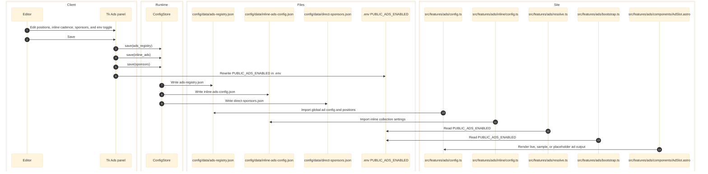

# Ads Panel — `config/panels/ads.py`

Manages the ad placement registry, inline-ad rules, direct-sponsor creatives, and the env-backed live ads toggle. Panel within the unified mega-app: `pythonw config/eg-config.pyw` (Ctrl+8). Ads is a multi-surface feature that edits three JSON contracts and one site env var across both the Tk shell and the React desktop shell.

Ads data is independent from the category contract. Its three JSON files and the `PUBLIC_ADS_ENABLED` env toggle have no cross-panel data dependency. When the site accent changes, the mega-app can still repaint the visible panel chrome, but category edits do not change ad payloads.

---

## Architecture



---

## Responsibilities

- Owns:
  - `config/data/ads-registry.json`
  - `config/data/inline-ads-config.json`
  - `config/data/direct-sponsors.json`
  - root `.env` key `PUBLIC_ADS_ENABLED`
- Exposes five internal tabs: Positions, Usage Scanner, Inline Config, Sponsors, Dashboard.

## Entry Points

- `config/panels/ads.py` - Tk implementation
- `config/app/runtime.py`, `config/app/main.py` - React backend payload, preview, save, and scan routes
- `config/ui/app.tsx`, `config/ui/panels.tsx`, `config/ui/desktop-model.ts`, `config/ui/ads-editor.mjs` - React frontend

## Write Targets

- `config/data/ads-registry.json`
- `config/data/inline-ads-config.json`
- `config/data/direct-sponsors.json`
- `.env` `PUBLIC_ADS_ENABLED`

## Downstream Consumers

- `src/features/ads/config.ts`
- `src/features/ads/inline/config.ts`
- `src/features/ads/inline/config.mjs`
- `src/features/ads/resolve.ts`
- `src/features/ads/bootstrap.ts`
- `src/features/ads/components/AdSlot.astro`

---

## Data Files

| File | Purpose |
|------|---------|
| `config/data/ads-registry.json` | Global ad settings and named ad positions |
| `config/data/inline-ads-config.json` | Per-collection inline-ad cadence and scaling rules |
| `config/data/direct-sponsors.json` | Direct-sponsor creatives grouped by placement |
| `config/data/categories.json` | Site accent color used by the GUI header/theme |
| `.env` | `PUBLIC_ADS_ENABLED` switch for live ads in dev and production |

---

## Global Runtime Knobs

The globals row in the panel edits these registry keys plus one env-backed runtime switch:

```env
PUBLIC_ADS_ENABLED=false
```

```text
Ads Enabled toggle -> .env PUBLIC_ADS_ENABLED
```

```json
{
  "adsenseClient": "ca-pub-5013419984370459",
  "adLabel": "Ad",
  "showProductionPlaceholders": true,
  "loadSampleAds": true,
  "sampleAdMode": "mixed",
  "sampleAdNetwork": "mixed"
}
```

What each knob does:
- `PUBLIC_ADS_ENABLED`: base runtime switch for live ads. When `true`, dev and production render the real ad wiring. When `false`, the site stays in placeholder/sample mode.
- `showProductionPlaceholders`: when ads are disabled, render the HBS-style production placeholder instead of the dev dashed placeholder.
- `loadSampleAds`: dev-only override that renders realistic sample creatives instead of live network markup.
- `sampleAdMode`: `mixed`, `svg`, or `video` for the sample creative format.
- `sampleAdNetwork`: `mixed`, `adsense`, `raptive`, `mediavine`, or `ezoic` for the simulated network profile.

Important behavior:
- `PUBLIC_ADS_ENABLED` is persisted to the project `.env` file, not the registry JSON.
- `loadSampleAds` affects development and Vite layout verification only.
- Production builds do not ship sample creative media files even if the registry toggle is on.
- Sample ads override live ad rendering in dev so page layouts can be reviewed against realistic ad shapes and motion.
- Only disabled production placeholders use the HBS-style framed shell. Live and sample slots keep their normal wrappers while slot reservation still prevents avoidable layout shift.

---

## Placements

Named positions in `ads-registry.json` look like this:

```json
{
  "provider": "adsense",
  "adSlot": "6560707323",
  "sizes": "300x400,300x250,300x300",
  "display": true,
  "placementType": "rail",
  "notes": "Standard sidebar/rail ad unit"
}
```

The placements UI supports:
- Search/filter by position name
- Provider-specific fields (`adsense` vs `direct`)
- Size editing with IAB presets
- Enable/disable toggles
- New/delete placement actions
- Import/export for the registry JSON

## Inline Ads

`inline-ads-config.json` controls per-collection inline insertion for `reviews`, `guides`, `news`, and optional collections such as `games`, `brands`, and `pages`.

The manager exposes:
- Default inline position selection
- Desktop/mobile enable flags
- Paragraph cadence controls (`firstAfter`, `every`, `max`)
- Word-scaling controls
- A live calculator preview using `calculate_inline_ads()`

## Direct Sponsors

`direct-sponsors.json` stores creatives per placement, including label, image, href, dimensions, weight, and date windows.

The manager supports:
- Add/delete creatives
- Weight normalization
- Active date fields
- Link/image/alt metadata

---

## Usage Scanner

The Usage Scanner tab searches `src/` for exact placement-name references via `grep_usages()`. This is the quickest way to confirm whether a named position is still wired into any `.astro`, `.ts`, `.tsx`, `.md`, or `.mdx` file.

## Save Behavior

- `Ctrl+S` saves changed data back to the three JSON files and updates `.env` when the live ads toggle changes.
- Unsaved state is tracked across placements, inline rules, and sponsors.
- Global sample-ad knobs round-trip through the panel and persist back to `ads-registry.json`.
- The live ads toggle round-trips through `PUBLIC_ADS_ENABLED` in `.env`.
- The status bar shows total positions and how many are enabled.

## Pure Helpers

These functions are intentionally GUI-independent and are good candidates for characterization or unit tests:
- `parse_sizes()`
- `filter_positions()`
- `calculate_inline_ads()`
- `normalize_weights()`
- `grep_usages()`

---

## State and Side Effects

- The `global` block in `ads-registry.json` controls AdSense client ID, ad label, sample-ad toggles, and production-placeholder behavior.
- `inline-ads-config.json` controls per-collection inline insertion cadence.
- `.env` `PUBLIC_ADS_ENABLED` is the master runtime gate the site checks before loading live ads.
- The panel includes a source scanner that searches `src/` for named position usage.

## Error and Boundary Notes

- `direct-sponsors.json` is still a first-class editor target, but no live `src/` import was verified in the current codebase.
- Runtime precedence in `AdSlot.astro` is:
  - sample ads first when `loadSampleAds` is enabled in allowed contexts
  - otherwise placeholders when ads are disabled
  - otherwise live provider output
- Both editor surfaces must preserve the same multi-file JSON plus `.env` mutation contract.

---

## Current Snapshot

- `ads-registry.json` currently defines `sidebar`, `sidebar_sticky`, `in_content`, `hero_leaderboard`, and `hero_companion`.
- `PUBLIC_ADS_ENABLED` is currently `false` in the root `.env`.
- Inline ads are currently enabled for `reviews`, `guides`, and `news`, and disabled for `games`, `brands`, and `pages`.

---

## Cross-Links

- [Categories](categories.md)
- [Slideshow](slideshow.md)
- [Image Defaults](image-defaults.md)
- [Cache / CDN](cache-cdn.md)
- [Environment and Config](../runtime/environment-and-config.md)
- [System Map](../architecture/system-map.md)
- [Data Contracts](../data/data-contracts.md)
- [Python Application](../runtime/python-application.md)
- [Routing and GUI](../frontend/routing-and-gui.md)
- [RULES.md](../RULES.md)
- [CATEGORY-TYPES.md](../CATEGORY-TYPES.md)
- [DRAG-DROP-PATTERN.md](../DRAG-DROP-PATTERN.md)

## Validated Against

- `config/panels/ads.py`
- `config/app/main.py`
- `config/app/runtime.py`
- `config/ui/app.tsx`
- `config/ui/panels.tsx`
- `config/ui/ads-editor.mjs`
- `config/data/ads-registry.json`
- `config/data/inline-ads-config.json`
- `config/data/direct-sponsors.json`
- `.env`
- `.env.example`
- `src/features/ads/config.ts`
- `src/features/ads/inline/config.ts`
- `src/features/ads/inline/config.mjs`
- `src/features/ads/resolve.ts`
- `src/features/ads/bootstrap.ts`
- `src/features/ads/components/AdSlot.astro`
- `config/tests/test_ads_panel.py`
- `test/config-data-wiring.test.mjs`
