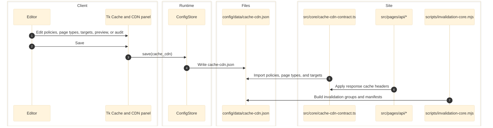

# Cache / CDN Panel — `config/panels/cache_cdn.py`

Manages the cache-policy contract stored in `config/data/cache-cdn.json`. Panel within the unified mega-app: `pythonw config/eg-config.pyw` (Ctrl+9). Cache / CDN manages the repository contract for cache headers and invalidation grouping across both the Tk shell and the React desktop shell.

---

## Architecture

---

## Responsibilities

- Owns `config/data/cache-cdn.json`.
- Manages three layers of cache configuration:
  - `policies`
  - `pageTypes`
  - `targets`
- Provides Preview and Audit views in both editor surfaces.

## Entry Points

- `config/panels/cache_cdn.py` - Tk implementation
- `config/app/runtime.py`, `config/app/main.py` - React backend payload, preview, and save routes
- `config/ui/app.tsx`, `config/ui/panels.tsx`, `config/ui/desktop-model.ts`, `config/ui/cache-cdn-editor.mjs` - React frontend

## Write Target

- `config/data/cache-cdn.json`

## Downstream Consumers

- `src/core/cache-cdn-contract.ts` -- validates `cache-cdn.json` and builds runtime headers
- `src/pages/api/search.ts` -- uses the `searchApi` policy for Cache-Control output
- `src/pages/api/auth/me.ts`
- `src/pages/api/auth/sign-in.ts`
- `src/pages/api/user/vault.ts`
- `scripts/invalidation-core.mjs` -- builds invalidation groups and manifests
- Deploy and routing docs use the same target inventory when describing current CloudFront behavior

---

## Data Model

`cache-cdn.json` has three coordinated layers:

| Section | Purpose |
|---------|---------|
| `policies` | Reusable Cache-Control recipes such as `staticPages`, `images`, and `dynamicApis` |
| `pageTypes` | Human-labeled document groups that each resolve to one policy |
| `targets` | Path-pattern groups that map actual routes to a page type |

## Current Policy Inventory

| Policy | Current intent |
|--------|----------------|
| `staticPages` | Browser revalidation with one-day edge caching |
| `hubPages` | Static shell caching reserved for `/hubs/*` contracts |
| `staticAssets` | Immutable long-lived cache for hashed assets |
| `images` | Immutable image caching with `Vary: Accept` |
| `searchApi` | Short-lived public cache for `/api/search` |
| `dynamicApis` | `no-store` for auth, session, vault, and fallback APIs |

The panel's Preview tab renders the exact header string produced by `build_policy_preview()` and the runtime helper `buildCacheControlHeader()`.

## Page Types and Route Targets

Current page types include:

- site pages
- hub pages
- static assets
- images
- search API
- auth and session
- user data
- API fallback

Current targets include:

- `*`
- `/hubs/*`
- `/_astro/*`, `/assets/*`, `/fonts/*`, `/js/*`
- `/images/*`
- `/api/search*`
- `/api/auth/*`, `/auth/*`, `/login/*`, `/logout*`
- `/api/user/*`, `/api/vault/*`
- `/api/*`

---

## Audit Behavior

The panel's Audit tab validates the current document in memory and reports:

- duplicate target ids
- duplicate path patterns
- invalid page-type references
- invalid policy references
- inconsistent `noStore` policy fields

The runtime contract in `src/core/cache-cdn-contract.ts` enforces the same shape and header constraints for application code.

## Save Behavior

- `Ctrl+S` writes `config/data/cache-cdn.json`
- Dirty tracking compares the normalized in-memory document to the last saved snapshot
- Preview and Audit are regenerated from the current in-memory config, not from a second source

---

## State and Side Effects

- Targets map path patterns to page types.
- Page types map to policies.
- Policies define browser cache, edge cache, `staleWhileRevalidate`, `varyHeaders`, and invalidation grouping.
- The panel normalizes legacy target entries that still use `policy` instead of `pageType`.

## Error and Boundary Notes

- This feature is file-backed only. There is no database or external cache service client inside the config app.
- The live site contract is enforced by `src/core/cache-cdn-contract.ts`, so both editor surfaces must preserve that schema exactly.

---

## Current Divergence That Remains Documented

- `hubPages` and the `/hubs/*` target are still live cache-policy contracts in `cache-cdn.json`.
- Helper code and navigation still emit `/hubs/...` URLs.
- This repo snapshot did not verify local `src/pages/hubs/**` route files.

Current interpretation: the cache and invalidation contract for `/hubs/*` exists, but the local file-based route implementation was not verified in this snapshot.

## Runtime Consumers

| Consumer | Use |
|----------|-----|
| `src/core/cache-cdn-contract.ts` | Validates `cache-cdn.json` and builds runtime headers |
| `src/pages/api/search.ts` | Uses the `searchApi` policy for Cache-Control output |
| Deploy and routing docs | Use the same target inventory when describing current CloudFront behavior |

## Current Snapshot

- `cache-cdn.json` currently defines the page types `sitePages`, `hubPages`, `staticAssets`, `images`, `searchApi`, `authAndSession`, `userData`, and `apiFallback`.
- Current targets are `static-pages`, `hub-pages`, `static-assets`, `images`, `search-api`, `auth-and-session`, `user-data`, and `api-fallback`.

---

## Cross-Links

- [Categories](categories.md)
- [Slideshow](slideshow.md)
- [Image Defaults](image-defaults.md)
- [Ads](ads.md)
- [System Map](../architecture/system-map.md)
- [Data Contracts](../data/data-contracts.md)
- [Python Application](../runtime/python-application.md)
- [Routing and GUI](../frontend/routing-and-gui.md)
- [RULES.md](../RULES.md)
- [CATEGORY-TYPES.md](../CATEGORY-TYPES.md)
- [DRAG-DROP-PATTERN.md](../DRAG-DROP-PATTERN.md)

## Validated Against

- `config/panels/cache_cdn.py`
- `config/app/main.py`
- `config/app/runtime.py`
- `config/ui/app.tsx`
- `config/ui/panels.tsx`
- `config/ui/cache-cdn-editor.mjs`
- `config/data/cache-cdn.json`
- `src/core/cache-cdn-contract.ts`
- `src/pages/api/search.ts`
- `src/pages/api/auth/me.ts`
- `src/pages/api/auth/sign-in.ts`
- `src/pages/api/user/vault.ts`
- `scripts/invalidation-core.mjs`
- `test/cache-cdn-contract.test.mjs`
- `test/config-data-wiring.test.mjs`
