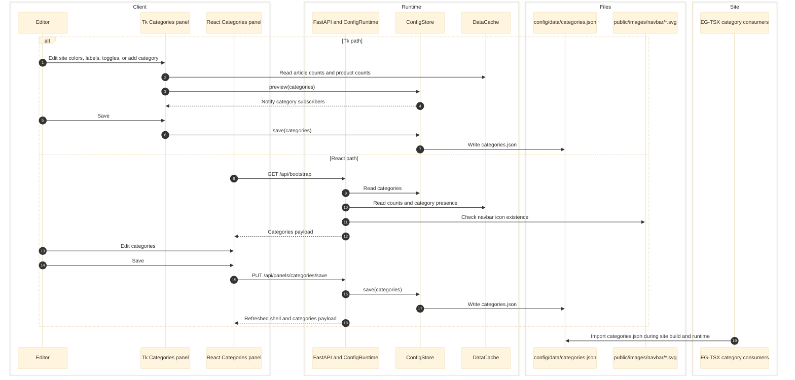

# Categories Panel

Categories is the root contract for category IDs, category labels, category colors, site theme colors, and production/vite flags for product and content categories. The panel manages the master category list, site theme colors, route flags, and the category collection contract stored in `config/data/categories.json` across both the Tk shell and the React desktop shell.

Panel within the unified mega-app: `pythonw config/eg-config.pyw` (Ctrl+1)



## Responsibilities

- Owns `config/data/categories.json`.
- Defines the canonical category ID list used across products, content, layout styling, and navigation.
- Defines `siteColors.primary` and `siteColors.secondary`.
- Tracks per-category `product.production`, `product.vite`, `content.production`, and `content.vite`.
- Auto-discovers category IDs from `src/content` and `src/content/data-products`.
- Checks whether `public/images/navbar/{id}.svg` exists.

## Entry Points

| Path | Client |
|------|--------|
| `config/panels/categories.py` | Tk |
| `config/ui/app.tsx` | React UI |
| `config/app/runtime.py` and `config/app/main.py` | React API |

## Write Target

- `config/data/categories.json`

## Downstream Consumers

- `src/core/category-contract.ts`
- `src/core/config.ts`
- `src/core/content.ts`
- `src/core/products.ts`
- `src/content.config.ts`
- `src/shared/layouts/GlobalNav.astro`
- `src/shared/layouts/MainLayout.astro`
- `src/styles/global.css`

## Card Layout

Each category entry in `categories.json` contains both visibility flags and collection capability metadata:

```json
{
  "id": "mouse",
  "label": "Mouse",
  "plural": "Mice",
  "color": "#00aeff",
  "product": { "production": true, "vite": true },
  "content": { "production": true, "vite": true },
  "collections": {
    "dataProducts": true,
    "reviews": true,
    "guides": true,
    "news": true
  }
}
```

`siteColors.primary` and `siteColors.secondary` live in the same file and are edited from the Site Theme row at the top of the window.

| Row | Content |
|-----|---------|
| 1 | Color swatch (clickable picker) + category ID + hex code |
| 2 | Label + plural text inputs |
| 3 | Product/content toggle rows (conditionally shown) |
| 4 | Data counts and navbar icon status |
| 5 | Derived color swatches (base, accent, hover, grad-start, score-end, dark, soft) |

## Smart Toggle Visibility

The Product and Content toggle rows are shown from the on-disk category type, not from the current flag values. See [CATEGORY-TYPES.md](../CATEGORY-TYPES.md).

| Filesystem state | Toggles shown |
|-----------------|---------------|
| Has `data-products/` folder and articles | Product + Content |
| Has articles only | Content only |
| Has product folder only | Product only |
| Neither | Product + Content |

## Filesystem Scanning

On launch, the manager scans:

```text
scan_category_presence() -> {cat_id: {has_products, has_content}}
count_products()         -> {cat_id: product_count}
count_articles()         -> {cat_id: {reviews, guides, news}}
```

Scanned paths:
- `src/content/data-products/{cat_id}/`
- `src/content/{reviews,guides,news}/**/*.{md,mdx}`

## Collections Contract

`collections` is the build contract that tells Astro which collections may legally reference a category.

| Key | Meaning |
|-----|---------|
| `collections.dataProducts` | Product JSON in `src/content/data-products/` may use this category |
| `collections.reviews` | Review frontmatter may use this category |
| `collections.guides` | Guide frontmatter may use this category |
| `collections.news` | News frontmatter may use this category |

Important behavior:
- The manager preserves `collections` on save.
- Auto-discovered categories are seeded from current product/article counts via `infer_collections()`.
- Manually added categories start with all `collections` flags `false`.

That last rule is intentional: a manual category should not become valid for any Astro collection until it is explicitly wired. This prevents silent publishing or bad frontmatter from slipping through the build.

## Auto-Discovery

`_auto_discover()` runs at launch. If a category ID appears in content frontmatter or as a `data-products/` subfolder but is missing from `categories.json`, the manager adds it with:
- A distinct generated color
- Default label/plural from the ID
- `product` and `content` flags set to `{ "production": false, "vite": true }`
- `collections` inferred from the discovered product/article counts

## Product/Content Flags

These flags control route visibility, not category type:

| Flag | Meaning |
|------|---------|
| `product.production` | Product hub routes enabled in production builds |
| `product.vite` | Product hub routes enabled in local dev |
| `content.production` | Editorial routes enabled in production builds |
| `content.vite` | Editorial routes enabled in local dev |

Typical workflow: enable `vite` first for local verification, then flip `production` when the category is ready to ship.

## Color Picker

Clicking the color swatch or hex label opens a picker with:
- HSL controls
- Hex and RGB input
- Dark/light preview
- Category icon preview
- Derived color swatches

## Live Propagation (Preview Broadcast)

Categories is the SSOT hub for the entire mega-app. Every change in this panel broadcasts immediately to all other panels via `ConfigStore.preview()`:

| User action | Broadcast | Downstream effect |
|-------------|-----------|-------------------|
| Pick site primary/secondary color | Immediate | All panels: accent refresh. Sidebar + context bar update |
| Pick category color | Immediate | All panels: category pills, card accents, filter badges |
| Toggle product/content flag | Immediate | Content: active flags. Hub Tools: category list. Slideshow: pool |
| Edit label/plural | Debounced (300ms) | All panels: display names in pills, cards, lists |
| Add new category | Immediate | All panels: new category appears in pills, filters, lists |

The broadcast uses a `_broadcasting` guard flag to prevent the Categories panel from re-entering its own `_on_external_change` subscriber during preview.

## Data Flow

- `config/data/categories.json` is the only persistent source of truth.
- `src/core/category-contract.ts` validates that file and exports typed category data.
- `src/core/config.ts` consumes the same contract for runtime filtering.
- `src/content.config.ts` derives its `z.enum(...)` values from the same contract.

There is no separate enum list to keep in sync anymore.

## State and Side Effects

- Tk uses `ConfigStore.preview(ConfigStore.CATEGORIES, ...)` so category changes can affect other loaded panels before save.
- Tk category changes also refresh shell accent colors immediately.
- The React shell re-fetches dependent clean panels through its preview/watch wiring so category labels, colors, and activation-state changes propagate without requiring a relaunch.
- React polls `/api/watch` every 2000 ms and refreshes clean panels when the disk version changes.

## Error and Boundary Notes

- The comment in `eg-config.pyw` says `Ctrl+1..7`, but the actual binding loop uses the full `_NAV_ITEMS` length, which is currently 9.
- React currently ignores all watched file versions except `categories`.
- Missing navbar SVG files do not block save; they surface as warnings in the panel payload and UI.

## Current Snapshot

- Current category IDs: `mouse`, `keyboard`, `monitor`, `headset`, `mousepad`, `controller`, `hardware`, `game`, `gpu`, `ai`
- Product-active categories: `mouse`, `keyboard`, `monitor`
- Content-active categories include `mouse`, `keyboard`, `monitor`, `hardware`, `game`, `gpu`, `ai`

## Cross-Links

- [Content Dashboard](content-dashboard.md)
- [Index Heroes](index-heroes.md)
- [Hub Tools](hub-tools.md)
- [Navbar](navbar.md)
- [Data Contracts](../data/data-contracts.md)
- [Routing and GUI](../frontend/routing-and-gui.md)
- [Python Application](../runtime/python-application.md)
- [System Map](../architecture/system-map.md)

## Validated Against

- `config/panels/categories.py`
- `config/eg-config.pyw`
- `config/app/main.py`
- `config/app/runtime.py`
- `config/ui/app.tsx`
- `config/lib/config_store.py`
- `config/lib/data_cache.py`
- `config/data/categories.json`
- `src/core/category-contract.ts`
- `src/core/config.ts`
- `src/core/content.ts`
- `src/core/products.ts`
- `src/content.config.ts`
- `src/shared/layouts/GlobalNav.astro`
- `src/shared/layouts/MainLayout.astro`
- `config/tests/test_react_desktop_api.py`
- `test/category-ssot-contract.test.mjs`
- `test/config-data-wiring.test.mjs`
