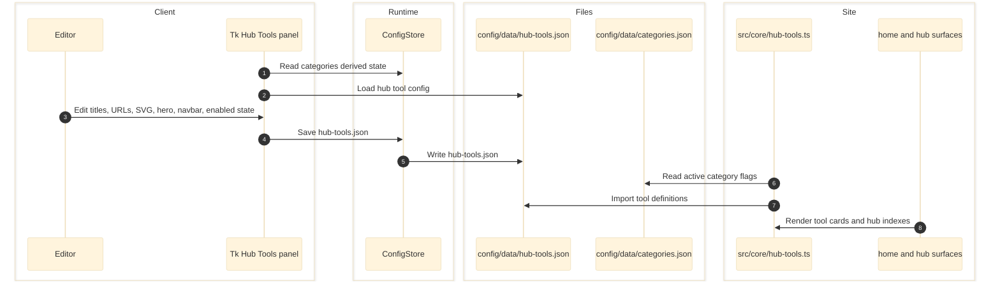

# Hub Tools Panel

Hub Tools manages the per-category tool cards used on home and hub surfaces. It is now implemented in both Tk and React. The panel manages hub-tool metadata for each non-content-only product category, reading and writing `config/data/hub-tools.json`.

Panel within the unified mega-app: `pythonw config/eg-config.pyw` (Ctrl+4)

Subscribes to `CATEGORIES` — when category flags/colors change in the Categories panel, the Hub Tools panel rebuilds its category list, filters content-only categories, and refreshes tool cards instantly via `_on_categories_change()`. Adding/removing product categories in Categories immediately updates the available category sidebar here.



## Responsibilities

- Owns `config/data/hub-tools.json`.
- Ensures each product category has entries for `hub`, `database`, `versus`, `radar`, and `shapes`.
- Supports Home and Index editing views.
- Tracks per-tool title, description, subtitle, URL, SVG, hero image, enabled state, navbar visibility, and `_index` grouping.

## Entry Points

| Path | Client |
|------|--------|
| `config/panels/hub_tools.py` | Tk |
| `config/app/runtime.py`, `config/app/main.py` | React backend |
| `config/ui/app.tsx`, `config/ui/panels.tsx`, `config/ui/desktop-model.ts` | React frontend |

## Write Target

- `config/data/hub-tools.json`

## Downstream Consumers

- `src/core/hub-tools.ts`
- Home-page tool surfaces
- Hub and category index surfaces

## What It Configures

Each product category (mouse, keyboard, monitor, plus inactive/manual headset, mousepad, controller) has 5 tool types stored in `config/data/hub-tools.json`. The runtime gateway and layout code use these entries for home-page tool surfaces, navigation, and `/hubs/...` URL contracts:

| Tool Type | URL Pattern | Purpose |
|-----------|-------------|---------|
| Hub | `/hubs/{cat}` | Category landing URL contract |
| Database | `/hubs/{cat}?view=list` | Database/list URL contract |
| Versus | `/hubs/{cat}?compare=stats` | Compare URL contract |
| Radar | `/hubs/{cat}?compare=radar` | Radar comparison URL contract |
| Shapes | `/hubs/{cat}?compare=shapes` | Shapes-view URL contract (mouse only) |

## Two Tabs

### Home Tab

Configures individual tool entries per category.

**Sidebar:** Category list (dimmed for inactive/manual categories). Click to switch which category's tools are shown.

**Tool Cards:** Each tool has editable fields:
- **Title** — display name
- **URL** — link target
- **Description** — tooltip/card text
- **Subtitle** — secondary text
- **Hero Image** — path stored in the `hero` field (`/images/tools/{cat}/{tool}/hero-img`)
- **Navbar** toggle — whether this tool shows in the navbar mega menu
- **SVG** — inline SVG icon markup (edit via dedicated SVG editor dialog)
- **Enabled** toggle — on/off (disabled tools are grayed everywhere)

**Shared Tooltips:** Edit button opens dialog for tool type descriptions shown on hover across all categories.

### Index Tab

Configures the `_index` slot arrays in `hub-tools.json` for the `/hubs/` dashboard URL contract — which 6 tools are featured and in what order.

**View Selector (left sidebar):**
- **All** — pool shows all tool types from all categories
- **Hub** — pool shows only hub-type tools
- **Database** — pool shows only database-type tools
- **Versus / Radar / Shapes** — same pattern

Each view has its own independent 6-slot arrangement.

**Slots (3x2 grid):**
- Start blank (grey)
- Drag a tool from the unassigned pool into a slot
- Slot takes the category color of the tool placed in it
- Shows category label, tool type, title, description, icon
- Remove button (x) to clear a slot
- Disabled tools show "OFF" badge but are still assignable

**Unassigned Pool (right):**
- Shows all tools matching the current view that aren't in any slot
- Disabled tools appear grayed with "(off)" suffix
- Drag from pool to slot to assign

**Auto-fill:** Empty slots are filled automatically at page build time from remaining tools. Explicit slot assignments take priority.

## Data Model — `config/data/hub-tools.json`

```json
{
  "mouse": [
    {
      "tool": "hub",
      "title": "Hub",
      "description": "Explore and compare over 500 gaming mouse",
      "subtitle": "Your One-Stop Mouse Hub",
      "url": "/hubs/mouse",
      "svg": "<svg ...>...</svg>",
      "enabled": true,
      "navbar": true,
      "hero": "/images/tools/mouse/hub/hero-img"
    }
    // ... 4 more tools (database, versus, radar, shapes)
  ],
  "keyboard": [ /* 5 tools */ ],
  "monitor": [ /* 5 tools */ ],
  "_tooltips": {
    "hub": "Your one-stop comparison hub...",
    "database": "The full spec database...",
    "versus": "Side-by-side comparisons...",
    "radar": "Multi-axis radar charts...",
    "shapes": "Overlay mouse shapes..."
  },
  "_index": {
    "all": ["keyboard:hub", "monitor:hub", "mouse:hub"],
    "hub": [],
    "database": [],
    "versus": [],
    "radar": [],
    "shapes": []
  }
}
```

### `_index` format

Keys are **view names** (not categories). Values are ordered arrays of `"category:tool_type"` strings representing slot assignments.

- `"all"` view: featured tools for the main `/hubs/` dashboard contract
- `"hub"` view: featured tools when filtering by hub type
- Empty array = all 6 slots auto-fill at build time
- Array shorter than 6 = explicit slots first, remaining auto-fill

### Key prefixes

- `_tooltips` — shared tooltip text (not a category)
- `_index` — dashboard slot assignments (not a category)
- Everything else is a category ID with an array of tool entries

## Category Filtering

Uses a **filesystem-backed content-only exclusion** plus product flags from `categories.json`. The panel gets content-only categories from `app.cache.get_content_only_cats()`, then uses `is_product_active()` to decide whether the remaining categories should render as active or dimmed. See [CATEGORY-TYPES.md](../CATEGORY-TYPES.md).

- **Content-only** categories (hardware, game, gpu, ai) are excluded entirely
- **Active product** categories (mouse, keyboard, monitor) show with full color
- **Inactive/manual product** categories (headset, mousepad, controller) show dimmed, all tools disabled by default

## Runtime Gateway

Components never read `hub-tools.json` directly. The gateway in `src/core/hub-tools.ts` filters tools by `CONFIG.categories` (active product categories) and sorts by tool priority.

| Gateway function | Purpose |
|-----------------|---------|
| `getDesktopTools()` | Flat list, sorted by tool priority then category order |
| `getMobileTools()` | Grouped by category, each group sorted by tool priority |
| `getToolsForCategory(catId)` | Tools for a specific category sidebar |
| `getToolTooltip(toolType)` | Shared tooltip text |

The runtime gateway preserves the configured `/hubs/...` URLs, but this Phase 0 audit did not verify local `src/pages/hubs/**` route files in the current repo snapshot.

## ensure_defaults()

On launch, auto-creates missing tool entries for any category that doesn't have all 5 tool types. Defaults:

- Inactive/manual categories: all tools `enabled: false`
- Shapes tool: `enabled: false` for all categories except mouse
- Hub tool: `navbar: true` by default, all others `navbar: false`

## State and Side Effects

- Disabled product categories from `categories.json` are treated as disabled in Hub Tools.
- `shapes` is automatically disabled for non-`mouse` categories.
- The site reads tool definitions through `src/core/hub-tools.ts` instead of importing the JSON directly in components.

## Error and Boundary Notes

- This feature depends on category activation rules from `categories.json`, so a React port cannot treat it as an isolated JSON editor.
- React APIs now exist: `GET /api/panels/hub-tools`, `PUT /api/panels/hub-tools/preview`, `PUT /api/panels/hub-tools/save`.

## Current Snapshot

- `hub-tools.json` currently has configured category blocks for `mouse`, `keyboard`, and `monitor`.
- The `_index.all` list currently contains `keyboard:hub`, `monitor:hub`, and `mouse:hub`.

## Cross-Links

- [Categories](categories.md)
- [Content Dashboard](content-dashboard.md)
- [Index Heroes](index-heroes.md)
- [Navbar](navbar.md)
- [Data Contracts](../data/data-contracts.md)
- [Routing and GUI](../frontend/routing-and-gui.md)
- [Python Application](../runtime/python-application.md)
- [System Map](../architecture/system-map.md)

## Validated Against

- `config/panels/hub_tools.py`
- `config/data/hub-tools.json`
- `config/data/categories.json`
- `config/app/main.py`
- `config/app/runtime.py`
- `config/ui/app.tsx`
- `config/ui/panels.tsx`
- `config/ui/desktop-model.ts`
- `src/core/hub-tools.ts`
- `src/features/home/README.md`
- `test/config-data-wiring.test.mjs`
