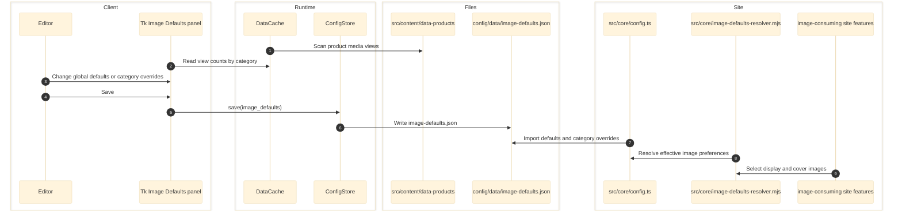

# Image Defaults Panel — `config/panels/image_defaults.py`

Manages global and per-category product image defaults in `config/data/image-defaults.json`. Panel within the unified mega-app: `pythonw config/eg-config.pyw` (Ctrl+7). Image Defaults controls product image selection priorities and per-category overrides across both the Tk shell and the React desktop shell.

Subscribes to `CATEGORIES` — when category colors/labels change in the Categories panel, the Image Defaults panel rebuilds its category pill bar and refreshes the view instantly via `_on_categories_change()`.

---

## Architecture



---

## Responsibilities

- Owns `config/data/image-defaults.json`.
- Manages global defaults and per-category overrides for image view selection.
- Uses observed product view counts to help the editor choose realistic defaults.

## Entry Points

- `config/panels/image_defaults.py` - Tk implementation
- `config/app/runtime.py`, `config/app/main.py` - React backend payload, preview, and save routes
- `config/ui/app.tsx`, `config/ui/panels.tsx`, `config/ui/desktop-model.ts`, `config/ui/image-defaults-editor.mjs` - React frontend

## Write Target

- `config/data/image-defaults.json`

## Managed Fields

- `defaultImageView`
- `listThumbKeyBase`
- `coverImageView`
- `headerGame`
- `viewPriority`
- `imageDisplayOptions`
- `viewMeta`
- per-category overrides merged on top of global defaults

## Downstream Consumers

- `src/core/config.ts` -- exports `imageDefaults()` and `viewObjectFit()`
- `src/core/image-defaults-resolver.mjs` -- performs the same merge logic at runtime
- Image-selection flows across the site, including slideshow and product surfaces

---

## Data Sources

| File | Purpose |
|------|---------|
| `config/data/image-defaults.json` | Persistent default/override config |
| `src/content/data-products/` | Scanned to discover real view usage per category |
| `config/data/categories.json` | Site accent and category labels/colors for the UI |

## Config Shape

The JSON has two layers:

```json
{
  "defaults": {
    "defaultImageView": ["top", "left", "feature-image", "sangle"],
    "listThumbKeyBase": ["left", "top", "sangle"],
    "coverImageView": ["feature-image", "sangle", "angle", "top", "left"],
    "headerGame": ["left", "top"],
    "viewPriority": ["feature-image", "top", "left", "right", "sangle"],
    "imageDisplayOptions": [],
    "viewMeta": {}
  },
  "categories": {
    "mouse": {
      "defaultImageView": ["right", "top", "left", "sangle"]
    }
  }
}
```

- `defaults` applies to every category.
- `categories.<id>` stores overrides only.
- The editor resolves a category by deep-merging its overrides on top of the global defaults.

## What the Manager Edits

For the global defaults or a selected category override, the UI lets you edit:
- `defaultImageView`
- `listThumbKeyBase`
- `coverImageView`
- `headerGame`
- `viewPriority` via drag reorder
- `viewMeta` per view (`objectFit`, label, short label)
- `imageDisplayOptions`

---

## Scanner Panel

The left scanner panel auto-scans all product JSON files and reports:
- Which image `view` names actually exist for the active category
- How common each view is across products
- Whether a view is canonical or an anomaly

This scan is the guardrail for picking sensible fallbacks instead of relying on guesswork.

## Editor Behavior

- The `__defaults__` pseudo-category edits the global contract.
- Real categories inherit from the global defaults unless an override is stored.
- Empty category overrides intentionally fall back to the shared defaults.
- The UI sorts fallback suggestions by coverage percentage, so common views rise to the top automatically.

## Save Behavior

- `Ctrl+S` writes `config/data/image-defaults.json`.
- Unsaved changes are tracked against the full resolved config.
- Tk close and React unload paths both guard against dropping dirty edits silently.

---

## State and Side Effects

- Global defaults live under `defaults`.
- Category-specific changes live under `categories.{categoryId}`.
- Effective runtime behavior is a merge, with deep merge behavior for `viewMeta`.

## Error and Boundary Notes

- The editor reads product media views from `src/content/data-products`; it is not editing a closed schema in isolation.
- Any future extension must preserve both the JSON editor contract and the product-view scanning support that currently comes from `DataCache`.

---

## Runtime Consumers

- `src/core/config.ts` exports `imageDefaults()` and `viewObjectFit()`.
- `src/core/image-defaults-resolver.mjs` performs the same merge logic at runtime.

This keeps the GUI, build, and runtime on the same contract instead of duplicating image fallback rules in components.

## Current Snapshot

- `image-defaults.json` currently has a category override only for `mouse`.
- The global `defaultImageView` order is currently `top`, `left`, `feature-image`, `sangle`.

---

## Cross-Links

- [Categories](categories.md)
- [Slideshow](slideshow.md)
- [Ads](ads.md)
- [Cache / CDN](cache-cdn.md)
- [System Map](../architecture/system-map.md)
- [Data Contracts](../data/data-contracts.md)
- [Python Application](../runtime/python-application.md)
- [Routing and GUI](../frontend/routing-and-gui.md)
- [RULES.md](../RULES.md)
- [CATEGORY-TYPES.md](../CATEGORY-TYPES.md)
- [DRAG-DROP-PATTERN.md](../DRAG-DROP-PATTERN.md)

## Validated Against

- `config/panels/image_defaults.py`
- `config/app/main.py`
- `config/app/runtime.py`
- `config/ui/app.tsx`
- `config/ui/panels.tsx`
- `config/ui/image-defaults-editor.mjs`
- `config/lib/data_cache.py`
- `config/data/image-defaults.json`
- `src/core/config.ts`
- `src/core/image-defaults-resolver.mjs`
- `test/image-defaults.test.mjs`
- `test/config-data-wiring.test.mjs`
