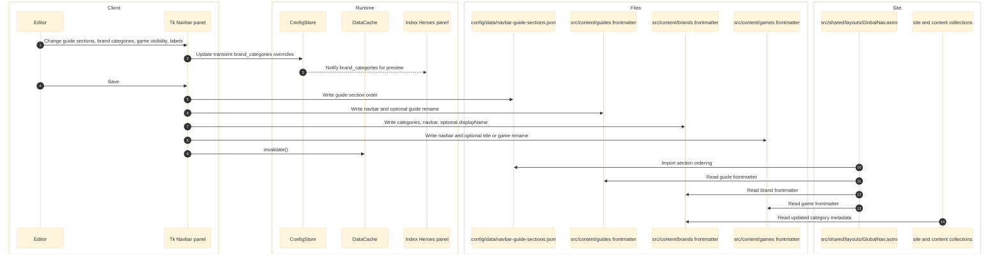

# Navbar Panel

Navbar is the highest-risk file-writing feature in the current config app because it edits both JSON and Markdown frontmatter. It manages navbar link assignments across 4 tabs, reading/writing frontmatter in content files plus `config/data/navbar-guide-sections.json`.

Panel within the unified config app (Ctrl+5).

Subscribes to `CATEGORIES` — when category colors/labels/flags change in the Categories panel, the Navbar panel's Hubs and Brands views update instantly via the categories cascade preview. No save or relaunch needed.

Current status:

- Tk: full implementation (`config/panels/navbar.py`)
- React: full implementation (React port)



## Responsibilities

- Owns `config/data/navbar-guide-sections.json`.
- Writes YAML frontmatter in:
  - `src/content/guides/**/*`
  - `src/content/brands/**/*`
  - `src/content/games/**/*`
- Controls navbar visibility and naming for guides, brands, and games.

## Entry Points

| Path | Client |
|------|--------|
| `config/panels/navbar.py` | Tk |
| `config/app/runtime.py`, `config/app/main.py` | React backend |
| `config/ui/app.tsx`, `config/ui/panels.tsx`, `config/ui/desktop-model.ts`, `config/ui/navbar-editor.ts` | React frontend |

## Write Targets

- `config/data/navbar-guide-sections.json`
- Guide frontmatter fields: `navbar`, optionally `guide`
- Brand frontmatter fields: `categories`, `navbar`, optionally `displayName`
- Game frontmatter fields: `navbar`, optionally `title`, and sometimes `game`

## Downstream Consumers

- `src/shared/layouts/GlobalNav.astro`
- Astro content collection readers for guides, brands, and games
- `config/panels/index_heroes.py` preview path for brand categories

## Architecture: Change-Delta Tracking

Unlike Panels 1-4 (which diff the full payload), Navbar tracks accumulated **change deltas** because authoritative state lives in frontmatter files. The payload is a read-only view from the server; local edits accumulate in a `NavbarLocalChanges` object alongside optimistic panel state updates. On save, only the deltas are sent. On response, the server re-scans frontmatter and returns fresh truth.

### NavbarLocalChanges shape

```typescript
{
  guideChanges: Record<string, { slug, category, navbar: string[] }>,
  brandChanges: Record<string, { slug, categories: string[], navbar: string[] }>,
  gameChanges: Record<string, { slug, navbar: boolean }>,
  renames: Array<{ slug, collection, field, value }>,
  sectionOrder: NavbarSectionOrder | null,
}
```

### Preview Scope

Preview is limited to **section order** (JSON) and **brand_categories** (transient). Frontmatter changes (guide moves, brand assignments, game toggles, renames) are optimistic-only and commit on save. This avoids temporary frontmatter writes.

## Four Tabs

### Guides Tab

Assigns guides to named sections within each category's navbar mega menu.

**Category pills:** Color-coded, flex-wrap at 120px min-width, inside the columns-area (left of divider). Wrap to new rows as needed, all equal width.

**Layout:** Horizontally scrollable section columns (left) | vertical divider | fixed pool-area (right: + Add Section button + search + Unassigned column, 280px).

**Section columns:** Each 280px fixed width, colored top bar, header with:
- Section name (bold, capitalize)
- Colored count badge (category color background)
- Hover-reveal controls: ◀ ▶ reorder | divider | ✎ rename, ✕ delete

**Drag-and-drop:**
- Drag guide from Unassigned pool into a section column to assign
- Drag between section columns to reassign
- Updates frontmatter `navbar:` field with section name

**Double-click rename:** Double-click any guide item to rename its `guide` frontmatter field (the short nav-friendly display name).

**Section management:**
- Add/Rename/Delete sections via dialogs
- Reorder sections with arrow buttons
- Section order stored in `config/data/navbar-guide-sections.json`

### Brands Tab

Assigns brands to category columns in the navbar.

**Layout:** All category columns visible simultaneously (one per category, horizontally scrollable, all 280px) | vertical divider | pool-area (search + "All Brands" column, 280px).

**No category pill selector** — all categories shown at once.

**All Brands pool:** Shows **every** brand in the system (not filtered by category), with search input above. Each brand shows colored category tags (one pill per assigned category, colored with that category's color).

**Category-colored checkboxes:** Brands in category columns show a custom checkbox filled with the category color when active (in navbar for that category), empty when hidden.

**Pencil edit button:** Appears on hover (right side of each brand item), click opens rename dialog for `displayName`.

**Drag-and-drop:**
- Drag from "All Brands" into a category column → adds to both `categories` and `navbar`
- Drag from category column → removes from that category
- Each column registers as `brand-{catId}` drop target

**Checkbox click:** Click the checkbox to toggle navbar visibility for that category. Only `navbar` changes — `categories` stays unchanged.

**Data:** Updates frontmatter `categories:` and `navbar:` fields, and `displayName` field in brand `.md` files.

### Games Tab

Toggle games on/off for navbar display.

**Layout:** Header row (bold "Games" title + count badge + "{n}/{total} active" + Toggle All button) + 3-column fixed grid.

**Game cards:** 3px left accent bar (theme color when active, grey when inactive), game name, hover-reveal pencil edit button, Toggle switch.

**Toggle All:** Single button activates/deactivates all games, label flips.

**Double-click rename:** Via pencil button or double-click → rename `game` and `title` frontmatter fields.

**Data:** Updates frontmatter `navbar:` boolean and `title`/`game` fields.

### Hubs Tab (display-only)

Read-only view of category activation flags.

**Layout:** Header row (bold "Hub Categories" title + count badge + italic "Read-only · Use Categories tab to edit flags") + vertical full-width card list.

**Hub cards:** 3px category-colored left accent bar, 12px color dot, bold category label, two status badges always shown:
- "PRODUCT" — green when `productActive`, grey when inactive
- "VITE" — blue when `viteActive`, grey when inactive

**No edits here** — use the Categories panel (Ctrl+1) to change activation flags. Changes propagate live via preview cascade.

## Data Files

| File | Format | Tab |
|------|--------|-----|
| `src/content/guides/**/index.md` | frontmatter `navbar`, `guide` | Guides |
| `src/content/brands/**/index.md` | frontmatter `categories`, `navbar`, `displayName` | Brands |
| `src/content/games/**/index.md` | frontmatter `navbar`, `title`, `game` | Games |
| `config/data/categories.json` | read-only (activation flags) | Hubs |
| `config/data/navbar-guide-sections.json` | `{cat: [section_names]}` | Guides |

## Implementation Files

| File | Role |
|------|------|
| `config/ui/panels.tsx` | `NavbarPanelView` component (~600 lines) |
| `config/ui/navbar-editor.ts` | Pure mutation functions (12 functions) |
| `config/ui/desktop-model.ts` | Types + `toNavbarRequestPayload()` + `snapshotNavbar()` |
| `config/ui/app.tsx` | State, handlers (13), save/preview/watch wiring |
| `config/ui/app.css` | `.navbar-panel__*` BEM styles |
| `config/app/runtime.py` | `get_navbar_payload()`, `save_navbar()`, `preview_navbar()` |

## Pure Editor Functions (`navbar-editor.ts`)

Each takes `(panel, changes)` → returns `[updatedPanel, updatedChanges]`:

**Guides:** `moveGuideToSection`, `addSection`, `deleteSection`, `renameSection`, `reorderSection`, `renameGuide`

**Brands:** `addBrandToCategory`, `removeBrandFromCategory`, `toggleBrandNavbar`, `renameBrand`

**Games:** `toggleGame`, `toggleAllGames`, `renameGame`

## Live Cross-Panel Propagation

### brand_categories (Navbar → Index Heroes)

When brand category assignments change (drag/drop), the Navbar panel preview sends `brandChanges` to the server. The server stores transient `store.brand_categories[slug] = [categories]`. Index Heroes' next payload call reads these overrides and updates brand hero preview.

On save, `brand_categories` is cleared (disk is authoritative). On external file change, it's also cleared.

### Categories cascade (Categories → Navbar)

When categories preview fires and navbar is NOT dirty, the app fetches a fresh navbar payload. This updates column bar colors, pill accents, hub badges, and category labels without any user action.

## Save Behavior

`Ctrl+S` sends `toNavbarRequestPayload(navbarChanges)` — delta only:

```typescript
{
  guideChanges: [...],     // frontmatter navbar field updates
  brandChanges: [...],     // frontmatter categories + navbar updates
  gameChanges: [...],      // frontmatter navbar boolean updates
  renames: [...],          // frontmatter scalar field renames
  sectionOrder: {...},     // JSON section order (if changed)
}
```

Server-side save:
1. Save section order → `ConfigStore.save(NAV_SECTIONS, sectionOrder)`
2. For each `guideChanges[]` → `write_navbar_list_field(path, "navbar", value)`
3. For each `brandChanges[]` → `write_navbar_list_field(path, "categories", cats)` + `write_navbar_list_field(path, "navbar", navbar)`
4. For each `gameChanges[]` → `write_navbar_bool_field(path, "navbar", value)`
5. For each `renames[]` → `write_navbar_scalar_field(path, field, value)`
6. Clear `brand_categories` transient state
7. Re-scan all frontmatter, return fresh `NavbarPanelPayload`

Response resets `navbarChanges` to empty and updates the snapshot ref.

## State and Side Effects

- Uses targeted frontmatter edits instead of rewriting entire Markdown files.
- Stores unsaved brand-category overrides in `ConfigStore.brand_categories` before save.
- Calls `DataCache.invalidate()` after rename or metadata writes so later readers re-scan the updated content tree.

## Error and Boundary Notes

- This feature does not have a JSON-only contract. A React port must support safe file mutation for frontmatter fields.
- Frontmatter writes are content-source mutations, not runtime cache updates.
- Because Index Heroes previews unsaved brand-category overrides, the transient `brand_categories` path also needs to survive any port.

## Current Snapshot

- `navbar-guide-sections.json` currently contains category keys for `mouse`, `keyboard`, and `monitor`.

## Cross-Links

- [Categories](categories.md)
- [Content Dashboard](content-dashboard.md)
- [Index Heroes](index-heroes.md)
- [Hub Tools](hub-tools.md)
- [Data Contracts](../data/data-contracts.md)
- [Routing and GUI](../frontend/routing-and-gui.md)
- [Python Application](../runtime/python-application.md)
- [System Map](../architecture/system-map.md)

## Validated Against

- `config/panels/navbar.py`
- `config/lib/config_store.py`
- `config/lib/data_cache.py`
- `config/data/navbar-guide-sections.json`
- `config/app/main.py`
- `config/app/runtime.py`
- `config/ui/app.tsx`
- `config/ui/panels.tsx`
- `config/ui/navbar-editor.ts`
- `config/ui/desktop-model.ts`
- `config/ui/app.css`
- `src/shared/layouts/GlobalNav.astro`
- `test/config-data-wiring.test.mjs`
- `test/config-react-desktop-port.test.mjs`
- `test/config-react-desktop-ui-contract.test.mjs`
