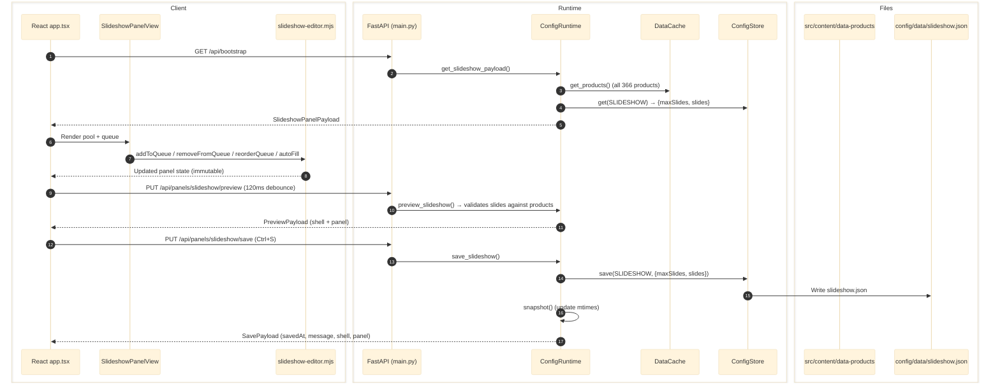

# Slideshow Panel

Manages the home page product carousel order. Two-panel drag-and-drop UI: searchable/filterable product pool (left) + numbered queue slots (right). Output: `config/data/slideshow.json`.

Implemented in both Tk (`config/panels/slideshow.py`) and React (`config/ui/panels.tsx` SlideshowPanelView). React is the active implementation.

Subscribes to `CATEGORIES` — when category colors/labels change, the slideshow panel receives a cascade refresh (120ms preview debounce or 2s watch polling) updating pill colors, labels, and accent colors.

---

## Architecture



---

## Responsibilities

- Owns `config/data/slideshow.json`.
- Builds and edits the ordered queue of home slideshow product IDs.
- Sets `maxSlides` (1–20).
- Provides auto-fill based on product metadata.

## Entry Points

| Runtime | File |
|---------|------|
| Tk (legacy) | `config/panels/slideshow.py` |
| React | `config/ui/panels.tsx` → `SlideshowPanelView` |
| Pure logic | `config/ui/slideshow-editor.mjs` (8 functions, 29 tests) |
| Tests | `config/tests/test_slideshow_editor.mjs` |

## API Routes

| Method | Route | Handler |
|--------|-------|---------|
| GET | `/api/panels/slideshow` | `runtime.get_slideshow_payload()` |
| PUT | `/api/panels/slideshow/preview` | `runtime.preview_slideshow(payload)` |
| PUT | `/api/panels/slideshow/save` | `runtime.save_slideshow(payload)` |

## Write Target

- `config/data/slideshow.json`

## Downstream Consumers

- `src/features/home/components/HomeSlideshow.astro`

---

## Data Sources

| File | Purpose |
|------|---------|
| `src/content/data-products/{cat}/{brand}/{slug}.json` | 366 products — ALL loaded, no eligibility filter |
| `config/data/categories.json` | Category colors, labels for filter tabs and accent propagation |
| `config/data/slideshow.json` | Persistent queue and maxSlides config |

## Output Format

```json
{
  "maxSlides": 10,
  "slides": [
    "razer-viper-v3-pro",
    "wooting-60he"
  ]
}
```

- `slides[]` = ordered Astro entry IDs (`{brand-slug}-{product-slug}`, matching glob loader format)
- `maxSlides` = configurable cap (1–20), persisted for Astro build

## Product Pool (no eligibility filter)

**All 366 products appear in the pool.** There is no score or image count filter — every product in `src/content/data-products/` is available for manual assignment. Products with `overall < 8.0` display a yellow warning badge on their queue tile.

Category tabs show only categories that have product data on disk (currently: mouse, keyboard, monitor + any others with `data-products/` folders), in config order from `categories.json`.

---

## UI Layout

Uses shared `content-panel` / `content-pool` / `content-dashboard` classes — identical visual language to Content, Index Heroes, and Hub Tools panels.

```
┌─────────────────────────────┬───┬──────────────────┐
│ Product Pool (flex: 1)      │ d │ Queue (320px)     │
│                             │ i │                    │
│ [Category tabs]             │ v │ Title + Auto-fill  │
│ [Sort pills] [Search]      │   │ + Clear + max      │
│                             │   │                    │
│ ┌─ content-pool ──────────┐ │   │ ┌─ dashboard ──┐  │
│ │ Brand  Model  Cat Score │ │   │ │ 1. Product   │  │
│ │ Brand  Model  Cat Score │ │   │ │ 2. Product   │  │
│ │ (drag or double-click)  │ │   │ │ 3. (empty)   │  │
│ └─────────────────────────┘ │   │ └──────────────┘  │
└─────────────────────────────┴───┴──────────────────┘
```

### Shared classes reused

- **Pool:** `content-pool`, `content-pool__accent`, `content-pool__header`, `content-pool__title`, `content-pool__meta`, `content-pool__table`, `content-pool__head`, `content-pool__body`, `content-pool__row`, `content-pool__cell`, `content-pool__empty`, `content-pool--drop-active`
- **Queue:** `content-dashboard`, `content-dashboard__header`, `content-dashboard__title-wrap`, `content-dashboard__title`, `content-dashboard__meta`, `content-dashboard__slot`, `content-dashboard__slot--filled`, `content-dashboard__slot--manual`, `content-dashboard__slot--drop-target`, `content-dashboard__slot-inner`, `content-dashboard__slot-top`, `content-dashboard__slot-labels`, `content-dashboard__slot-number`, `content-dashboard__slot-badge`, `content-dashboard__slot-body`, `content-dashboard__slot-title`, `content-dashboard__slot-bottom`, `content-dashboard__slot-category`, `content-dashboard__slot-date`, `content-dashboard__slot-empty`, `content-dashboard__remove`
- **Tabs/pills:** `content-panel__main-tabs`, `content-panel__main-tab`, `content-panel__sort-pills`, `content-panel__sort-pill`, `content-panel__search`, `content-panel__search-label`, `field__input`
- **Buttons:** `token-button`, `token-button--quiet`, `token-button--danger`
- **Drag:** `DragGhost`, `useDragGhost`, `createDropHandler`, `contentAccentStyle`

### Slideshow-specific CSS (overrides only)

- `--slideshow-accent` — CSS variable set on root section, propagates selected category color to tabs, sort pills, accent bar, and divider
- Pool grid columns: `0.8fr 1fr 62px 48px 70px 24px` (brand, model, cat, score, date, deal)
- Queue grid: vertical `flex-direction: column` (overrides dashboard 12-col grid)
- Queue slot min-height: `56px`
- Score badge warning: yellow border + yellow badge text for `overall < 8.0`

## Interactions

| Action | Behavior |
|--------|----------|
| Drag pool → queue slot | Add product at drop position |
| Double-click pool item | Quick-add to end of queue |
| Drag within queue | Reorder (move from slot to slot) |
| Drag queue → pool | Remove from queue |
| `×` button on queue tile | Remove from queue |
| Delete/Backspace on focused tile | Remove selected item |
| Up/Down arrows on focused tile | Move item up/down in queue |
| Auto-fill button | Fill empty slots (score ≥ 8, deals first, max 3/cat) |
| Clear button | Empty the entire queue |
| Max spinner (1–20) | Set slot count, truncates queue if needed |
| Search field | Filter pool by brand + model (live, case-insensitive) |
| Category tabs | Filter pool by category (config order, only categories with products) |
| Sort pills | Sort pool by: Score, Release, Brand, Model |

---

## Auto-fill Logic

Implemented in `slideshow-editor.mjs` → `autoFill()`, matching Python `auto_fill_slots()` in `panels/slideshow.py`.

1. Filter: `overall >= 8.0` required, exclude products already in queue
2. Sort key: `(hasDeal ? 0 : 1) ASC, releaseYear DESC, releaseMonth DESC, overall DESC`
3. Round-robin: max 3 per category (`MAX_PER_CAT = 3`)
4. Fill only empty slots (preserves existing manual picks)
5. Respects `maxSlides` cap

---

## Category Color Propagation

When a category tab is selected, `--slideshow-accent` is set on the root `<section>`. This drives:

| Element | Property | Fallback |
|---------|----------|----------|
| Active main tab | `border-bottom-color` | `--theme-site-primary` |
| Active sort pill | `background` | `--theme-site-primary` |
| Pool accent bar | `background` | `--theme-site-primary` |
| Vertical divider | `background` | `--color-surface-2` |

When "All" is selected, `--slideshow-accent` is unset and all elements fall back to defaults.

---

## Live Preview & Watch Polling

| Behavior | Implementation |
|----------|---------------|
| Preview debounce | 120ms `setTimeout`, race-safe request ID |
| Preview payload | `PUT /api/panels/slideshow/preview` → `{slides, maxSlides}` |
| Preview response | Server validates slides against product set, returns full panel payload |
| Watch key | `slideshow` (mtime of `config/data/slideshow.json`) |
| Watch interval | 2s polling via `GET /api/watch` |
| Categories cascade (preview) | Slideshow re-fetched when categories preview fires (if not dirty) |
| Categories cascade (watch) | Slideshow re-fetched when external `categories.json` change detected |
| Dirty guard | Cascade skipped if slideshow has unsaved local changes |

---

## Pure Editor Functions (`slideshow-editor.mjs`)

All functions are immutable `(panel) => panel`:

| Function | Purpose |
|----------|---------|
| `addToQueue(panel, entryId, position?)` | Add product, guard: no dupes, no exceed maxSlides |
| `removeFromQueue(panel, entryId)` | Remove by entryId |
| `reorderQueue(panel, fromIndex, toIndex)` | Move item between positions |
| `moveInQueue(panel, index, direction)` | Swap with neighbor (-1 up, +1 down) |
| `setMaxSlides(panel, max)` | Clamp 1–20, truncate queue if needed |
| `clearQueue(panel)` | Empty slides array |
| `autoFill(panel)` | Fill empty slots (matches Python sort key exactly) |
| `parseReleaseDate(raw)` | Parse "MM/YYYY" → `[year, month]` |

**Tests:** 29 tests in 8 suites — `node --test config/tests/test_slideshow_editor.mjs`

---

## Astro Integration

`HomeSlideshow.astro` reads `config/data/slideshow.json`:
- If `slides[]` has entries, use config-driven order
- If `slides[]` is empty, fall back to algorithmic selection (top 10 by score)
- Missing/invalid entry IDs are silently skipped

---

## Cross-Links

- [Categories](categories.md)
- [Panel Interconnection Matrix](../architecture/panel-interconnection-matrix.md)
- [Live Test Matrix](../LIVE-TEST-MATRIX.md)
- [Data Contracts](../data/data-contracts.md)
- [DRAG-DROP-PATTERN.md](../DRAG-DROP-PATTERN.md)
- [CATEGORY-TYPES.md](../CATEGORY-TYPES.md)

## Validated Against

- `config/ui/panels.tsx` (SlideshowPanelView)
- `config/ui/slideshow-editor.mjs`
- `config/tests/test_slideshow_editor.mjs`
- `config/ui/app.tsx` (state wiring, preview, watch, cascade)
- `config/ui/desktop-model.ts` (SlideshowPanelPayload, snapshot, request)
- `config/ui/app.css` (slideshow panel section)
- `config/app/runtime.py` (get/preview/save slideshow)
- `config/app/main.py` (3 routes + bootstrap)
- `config/lib/data_cache.py` (get_products — no eligibility filter)
- `config/data/slideshow.json`
- `config/panels/slideshow.py` (Tk legacy, auto_fill_slots reference)
