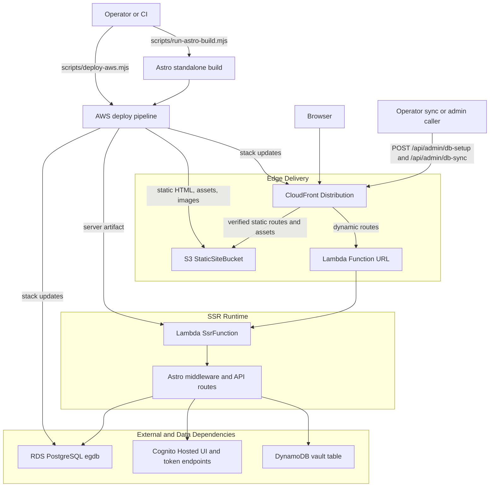

# System Map

Validated against:

- `astro.config.mjs`
- `lambda-entry.mjs`
- `infrastructure/aws/eg-tsx-stack.yaml`
- `scripts/run-astro-build.mjs`
- `scripts/deploy-aws.mjs`
- `src/middleware.ts`
- `src/pages/api/search.ts`
- `src/pages/api/auth/**`
- `src/pages/api/user/vault.ts`
- `src/pages/api/vault/thumbs.ts`
- `src/pages/api/admin/db-setup.ts`
- `src/pages/api/admin/db-sync.ts`
- `src/features/auth/server/**`
- `src/features/vault/server/db.ts`

See also:

- [Database Schema](data-model.md)
- [Environment and Config](../02-dependencies/environment-and-config.md)
- [Routing and GUI](routing-and-gui.md)
- [Auth Feature Flow](../04-features/auth.md)
- [Search Feature Flow](../04-features/search.md)
- [Vault Feature Flow](../04-features/vault.md)
- [src/pages/README.md](../../src/pages/README.md)
- [scripts/README.md](../../scripts/README.md)
- [infrastructure/aws/README.md](../../infrastructure/aws/README.md)

## Runtime and deployment topology

## Verified delivery split

| Surface | Current origin | Verified implementation |
|---|---|---|
| `/`, `/reviews/*`, `/guides/*`, `/news/*`, `/brands/*`, `/404`, `/_astro/*`, `/assets/*`, `/images/*`, `/fonts/*`, `/js/*` | S3 behind CloudFront | Static build output from Astro, delivered by the static origin |
| `/api/search*` | Lambda Function URL behind CloudFront | PostgreSQL-backed full-text search with short-lived edge/browser caching |
| `/api/auth/*`, `/auth/*`, `/login/*`, `/logout*` | Lambda Function URL behind CloudFront | Cognito sign-in, callback, logout, and session inspection |
| `/api/user/*`, `/api/vault/*` | Lambda Function URL behind CloudFront | Authenticated vault read/write and thumbnail normalization |
| `/api/admin/*` | Lambda Function URL behind CloudFront | Operator-only schema bootstrap and search-mirror sync |
| `/robots.txt` | Lambda Function URL behind CloudFront | Dynamic robots response |

## Runtime boundaries

- `astro.config.mjs` uses `@astrojs/node` in `standalone` mode, so the deployed server artifact is the Astro Node runtime rather than edge middleware or a container.
- `lambda-entry.mjs` proxies Lambda Function URL traffic into the local Astro server entry on `127.0.0.1:${PORT || 4321}`.
- `src/middleware.ts` runs on SSR requests only. It skips prerendered pages, reads auth cookies, refreshes near-expiry sessions, and populates `Astro.locals.user`.
- `src/pages/api/search.ts` is the only verified PostgreSQL-backed public API in this repo snapshot.
- `src/pages/api/user/vault.ts` is the verified DynamoDB-backed authenticated API surface.
- No queue consumer, cron worker, background job runner, or persistent worker entrypoint was verified in this repository snapshot. The only verified operational write paths are operator-triggered deploy and DB sync flows.

## Infrastructure notes

- The public entrypoint is always CloudFront. Static and dynamic traffic are split by CloudFront behaviors defined in `infrastructure/aws/eg-tsx-stack.yaml`.
- The stack provisions Lambda, CloudFront, the static S3 bucket, VPC networking, and RDS PostgreSQL. Cognito and the DynamoDB vault table are external inputs to the stack, not resources created by this template.
- Lambda runtime env injection is defined in the stack for `APP_ENV`, `DATABASE_URL`, `NODE_ENV`, `PUBLIC_COGNITO_*`, `COGNITO_DOMAIN`, `COGNITO_CALLBACK_URL`, `COGNITO_LOGOUT_URL`, and `DYNAMODB_TABLE_NAME`. See [Environment and Config](../02-dependencies/environment-and-config.md).
- The search mirror schema exists in two verified forms:
  - reference DDL in `scripts/schema.sql`
  - runtime DDL in `src/pages/api/admin/db-setup.ts`
- Search mirror writes happen through:
  - direct DB access via `scripts/sync-db.mjs`
  - HTTPS admin sync via `/api/admin/db-sync`

## `/hubs/*` contract status

- `config/data/cache-cdn.json` and the CloudFront stack still reserve `/hubs/*` as a static-cache target.
- Helper code, product data, and navigation still emit `/hubs/...` URLs.
- This repository snapshot does not contain verified local `src/pages/hubs/**` route files.
- Current interpretation: `/hubs/...` is a live URL contract in data/config/helpers, but not a locally verified route implementation in this snapshot. The route-file audit is documented in [Routing and GUI](routing-and-gui.md).

## Validation notes

- Executed: `node scripts/validate-image-links.mjs`
  - Result: `0` content/image mismatches, `12` orphan image folders under `public/images`
- Not executed: full Astro build
  - Reason: this second-pass docs cleanup focused on boundary contracts, path accuracy, and link validation rather than a production build run
