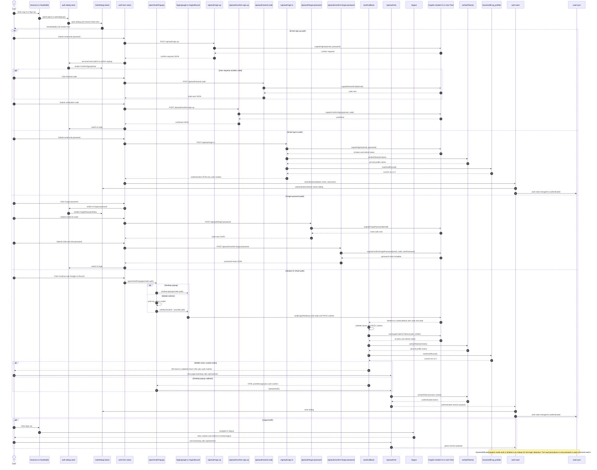

# Auth

Validated against:

- `src/shared/layouts/NavIcons.astro`
- `src/shared/layouts/NavMobile.tsx`
- `src/features/auth/components/**`
- `src/features/auth/oauth-popup.ts`
- `src/features/auth/store.ts`
- `src/features/auth/server/login-redirect.ts`
- `src/pages/api/auth/*.ts`
- `src/pages/auth/callback.ts`
- `src/pages/logout.ts`

## Traceability

| Layer | Artifacts |
|---|---|
| Frontend map | [Auth Surface](../03-architecture/routing-and-gui.md#auth-surface) |
| Shared entry points | [`NavIcons.astro`](../../src/shared/layouts/NavIcons.astro), [`NavMobile.tsx`](../../src/shared/layouts/NavMobile.tsx) |
| Dialog and forms | [`AuthDialog.tsx`](../../src/features/auth/components/AuthDialog.tsx), [`LoginView.tsx`](../../src/features/auth/components/LoginView.tsx), [`SignupView.tsx`](../../src/features/auth/components/SignupView.tsx), [`ConfirmSignupView.tsx`](../../src/features/auth/components/ConfirmSignupView.tsx), [`ForgotPasswordView.tsx`](../../src/features/auth/components/ForgotPasswordView.tsx) |
| Client state | [`store.ts`](../../src/features/auth/store.ts), [`oauth-popup.ts`](../../src/features/auth/oauth-popup.ts) |
| Runtime routes | [`/api/auth/sign-in`](../../src/pages/api/auth/sign-in.ts), [`/api/auth/sign-up`](../../src/pages/api/auth/sign-up.ts), [`/api/auth/confirm-sign-up`](../../src/pages/api/auth/confirm-sign-up.ts), [`/api/auth/forgot-password`](../../src/pages/api/auth/forgot-password.ts), [`/api/auth/confirm-forgot-password`](../../src/pages/api/auth/confirm-forgot-password.ts), [`/api/auth/resend-code`](../../src/pages/api/auth/resend-code.ts), [`/api/auth/me`](../../src/pages/api/auth/me.ts), [`/auth/callback`](../../src/pages/auth/callback.ts), [`/logout`](../../src/pages/logout.ts) |
| Data schema | [`DynamoDB vault store`](../03-architecture/data-model.md#dynamodb-vault-store) |
| Adjacent features | [Vault](./vault.md) |
| Standalone Mermaid | [auth.mmd](./auth.mmd) |

## Runtime surface

| Route | Role |
|---|---|
| `/api/auth/sign-up` | Create an email and password account in Cognito |
| `/api/auth/confirm-sign-up` | Confirm the verification code for a newly registered account |
| `/api/auth/resend-code` | Resend the verification code |
| `/api/auth/sign-in` | Email and password sign-in |
| `/api/auth/forgot-password` | Request a reset code |
| `/api/auth/confirm-forgot-password` | Complete the password reset |
| `/login/google` | Start Google Hosted UI login |
| `/login/discord` | Start Discord Hosted UI login |
| `/auth/callback` | Exchange the OAuth code, verify the token, and issue cookies |
| `/api/auth/me` | Rehydrate the client auth store from the session cookie |
| `/logout` | Clear local cookies and continue to hosted logout |

## Sequence Diagram

## Flow Notes

- Every GUI entry point converges on the same auth dialog store, so desktop and
  mobile triggers share one runtime path after the click.
- Email sign-in and Hosted UI OAuth both consult DynamoDB `rev` before the
  response returns. That lookup is used for first-login detection and later
  vault merge behavior.
- `/api/auth/me` is the rehydration boundary used by popup completion, mobile
  redirect completion, and general page bootstrap.
- Logout is a runtime route, not a client-only state reset. The client store may
  flip to guest immediately, but the durable boundary is still `/logout`.
- First-login merge behavior and ongoing compare persistence are expanded in
  [vault.md](./vault.md).
