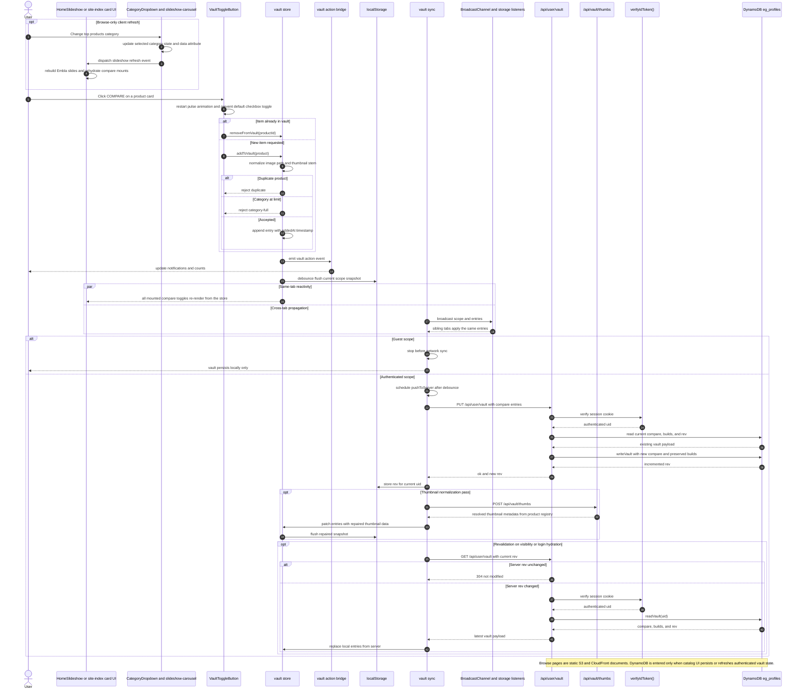

# Catalog

Validated against:

- `src/pages/index.astro`
- `src/pages/reviews/[...slug].astro`
- `src/pages/guides/[...slug].astro`
- `src/pages/news/[...slug].astro`
- `src/pages/brands/[...slug].astro`
- `src/features/home/components/**`
- `src/features/home/slideshow-carousel.ts`
- `src/features/site-index/components/**`
- `src/features/vault/components/VaultToggleButton.tsx`
- `src/features/vault/store.ts`
- `src/features/vault/sync.ts`
- `src/pages/api/user/vault.ts`
- `src/pages/api/vault/thumbs.ts`

## Traceability

| Layer | Artifacts |
|---|---|
| Frontend map | [Catalog Surface](../03-architecture/routing-and-gui.md#catalog-surface), [Home View Hierarchy](../03-architecture/routing-and-gui.md#home-view-hierarchy) |
| Home browse UI | [`HomeHero.astro`](../../src/features/home/components/HomeHero.astro), [`TopProducts.astro`](../../src/features/home/components/TopProducts.astro), [`CategoryDropdown.tsx`](../../src/features/home/components/CategoryDropdown.tsx), [`HomeSlideshow.astro`](../../src/features/home/components/HomeSlideshow.astro), [`slideshow-carousel.ts`](../../src/features/home/slideshow-carousel.ts) |
| Index browse UI | [`SiteIndexPage.astro`](../../src/features/site-index/components/SiteIndexPage.astro), [`IndexBleed.astro`](../../src/features/site-index/components/IndexBleed.astro), [`IndexBody.astro`](../../src/features/site-index/components/IndexBody.astro), [`BrandBody.astro`](../../src/features/site-index/components/BrandBody.astro), [`CategorySidebar.astro`](../../src/features/site-index/components/CategorySidebar.astro), [`FeedVertical.astro`](../../src/features/site-index/components/FeedVertical.astro) |
| Compare UI and state | [`VaultToggleButton.tsx`](../../src/features/vault/components/VaultToggleButton.tsx), [`store.ts`](../../src/features/vault/store.ts), [`sync.ts`](../../src/features/vault/sync.ts) |
| Runtime routes | [`/api/user/vault`](../../src/pages/api/user/vault.ts), [`/api/vault/thumbs`](../../src/pages/api/vault/thumbs.ts) |
| Data schemas | [`products`](../03-architecture/data-model.md#products), [`articles`](../03-architecture/data-model.md#articles), [`DynamoDB vault store`](../03-architecture/data-model.md#dynamodb-vault-store) |
| Adjacent features | [Home](./home.md), [Search](./search.md), [Vault](./vault.md) |
| Standalone Mermaid | [catalog.mmd](./catalog.mmd) |

## Runtime surface

| Surface | Role |
|---|---|
| `/` | Static home landing page with client-side top-products filtering and compare controls |
| `/reviews/*`, `/guides/*`, `/news/*`, `/brands/*` | Static browse families backed by the site-index view model |
| `/api/user/vault` | Authenticated compare persistence into DynamoDB |
| `/api/vault/thumbs` | Thumbnail repair and normalization for vault entries |

## Sequence Diagram

## Flow Notes

- Catalog is split across static browse delivery and dynamic compare persistence.
  The browse pages themselves do not require a live database query once built.
- The home landing-page composition that feeds the slideshow, dashboard, games,
  and featured rails is documented separately in [home.md](./home.md).
- `CategoryDropdown.tsx` and `slideshow-carousel.ts` form a client-only browse
  control loop. They refresh the slideshow presentation without touching the DB.
- `VaultToggleButton.tsx`, `vault/store.ts`, and `vault/sync.ts` are the runtime
  boundary where a catalog click can become a DynamoDB write.
- Thumbnail repair is deliberately separated into `/api/vault/thumbs`. It uses
  the product registry to normalize image metadata without hitting DynamoDB.
- The full compare-state lifecycle, toast bridge, first-login merge, and
  revision-based sync loop are expanded in [vault.md](./vault.md).
- Search-backed discovery into product and article URLs is documented separately
  in [search.md](./search.md). Auth-driven first-login merge behavior is
  documented separately in [auth.md](./auth.md).
