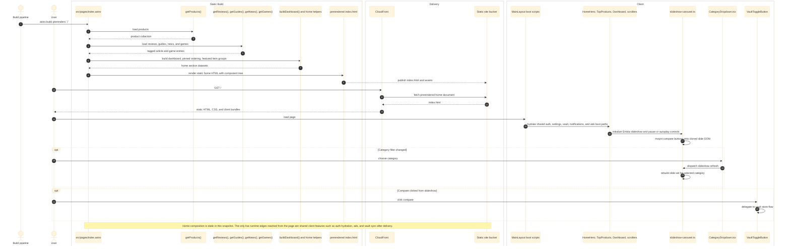

# Home

Validated against:

- `src/pages/index.astro`
- `src/core/content.ts`
- `src/core/products.ts`
- `src/core/dashboard.ts`
- `src/features/home/components/HomeHero.astro`
- `src/features/home/components/TopProducts.astro`
- `src/features/home/components/HomeSlideshow.astro`
- `src/features/home/components/Dashboard.astro`
- `src/features/home/components/GamesScroller.astro`
- `src/features/home/components/FeaturedScroller.astro`
- `src/features/home/components/LatestNews.astro`
- `src/features/home/featured-scroller-utils.ts`
- `src/features/home/slideshow-carousel.ts`
- `src/features/home/slideshow-autoplay.ts`
- `src/features/home/slideshow-deal.ts`
- `src/features/home/tests/slideshow-autoplay.test.mjs`
- `src/features/home/tests/slideshow-deal.test.mjs`
- `src/features/vault/components/VaultToggleButton.tsx`
- `src/features/ads/components/AdSlot.astro`

## Traceability

| Layer | Artifacts |
|---|---|
| Frontend map | [Home View Hierarchy](../03-architecture/routing-and-gui.md#home-view-hierarchy), [Catalog Surface](../03-architecture/routing-and-gui.md#catalog-surface) |
| Related docs | [System Map](../03-architecture/system-map.md), [Database Schema](../03-architecture/data-model.md#postgresql-search-mirror), [Routing and GUI](../03-architecture/routing-and-gui.md) |
| Adjacent features | [Catalog](./catalog.md), [Vault](./vault.md), [Notifications](./notifications.md) |
| Standalone Mermaid | [home.mmd](./home.mmd) |

## Responsibilities

- Assemble the prerendered landing page at `/` from mirrored product and article content.
- Derive section-specific datasets for the dashboard, games scroller, featured review and guide rails, and latest news feed.
- Mount the client-side slideshow controls, category filtering, and compare toggles after static HTML delivery.
- Place ad slots into the home rails without turning the page itself into a Lambda route.

## Runtime Surface

| Surface | Role |
|---|---|
| `/` | Prerendered home document served from S3 through CloudFront |
| `HomeHero.astro` | Hero copy, stat tiles, and browse shortcuts |
| `TopProducts.astro` | Home intro wrapper for category filter, slideshow, and hub-tools sidebar |
| `HomeSlideshow.astro` plus `slideshow-carousel.ts` | Server-rendered slides plus Embla-driven client behavior |
| `Dashboard.astro` | Editorial landing grid built from reviews, guides, and news |
| `GamesScroller.astro` | Horizontal game card rail built from `getGames()` |
| `FeaturedScroller.astro` | Category-tabbed review and guide rails |
| `LatestNews.astro` | Split-grid and feed rendering for remaining news entries |

No dedicated home API route was verified in this snapshot. Home data is loaded
through the content and product gateways during the static build.

## Sequence Diagram

## Flow Notes

- `index.astro` owns the page-level orchestration. It does not call a home API;
  it reads the mirrored content and product sources directly through core
  loaders, then passes section-specific datasets into the home components.
- The slideshow uses a split model: `HomeSlideshow.astro` serializes the slide
  payload into the HTML, while `slideshow-carousel.ts` owns autoplay, arrow
  behavior, category filtering, lazy image loading, and post-clone compare
  button hydration.
- `TopProducts.astro` still emits `/hubs/*` links through the hub-tools config
  surface even though no local `src/pages/hubs/**` route file was verified in
  this snapshot.
- Compare clicks inside the home slideshow do not define their own persistence
  path; they hand off to the shared [Vault](./vault.md) flow, which can then
  emit [Notifications](./notifications.md).
