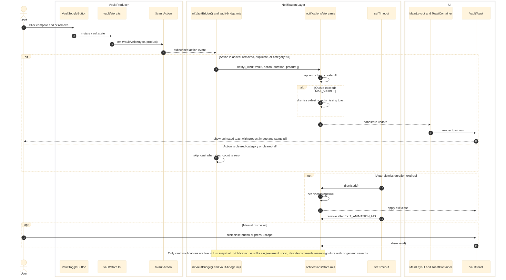

# Notifications

Validated against:

- `src/shared/layouts/MainLayout.astro`
- `src/features/notifications/index.ts`
- `src/features/notifications/store.ts`
- `src/features/notifications/store.mjs`
- `src/features/notifications/types.ts`
- `src/features/notifications/vault-bridge.ts`
- `src/features/notifications/vault-bridge.mjs`
- `src/features/notifications/components/ToastContainer.tsx`
- `src/features/notifications/components/VaultToast.tsx`
- `src/features/notifications/tests/vault-toast-image.test.mjs`
- `src/features/vault/vault-action.ts`
- `src/features/vault/vault-action.mjs`
- `src/features/vault/components/VaultToggleButton.tsx`
- `src/features/vault/store.ts`

## Traceability

| Layer | Artifacts |
|---|---|
| Frontend map | [Notification Surface](../03-architecture/routing-and-gui.md#notification-surface), [Vault Surface](../03-architecture/routing-and-gui.md#vault-surface) |
| Related docs | [Routing and GUI](../03-architecture/routing-and-gui.md), [Vault](./vault.md) |
| Adjacent features | [Vault](./vault.md), [Home](./home.md) |
| Standalone Mermaid | [notifications.mmd](./notifications.mmd) |

## Responsibilities

- Mount the global toast container once from `MainLayout.astro`.
- Subscribe to vault action events and translate them into typed notification payloads.
- Enforce a maximum visible queue, auto-dismiss durations, and exit-animation timing.
- Render vault-specific toast UI with product imagery, action pills, and manual dismiss controls.

## Runtime Surface

| Surface | Role |
|---|---|
| `MainLayout.astro` boot script | Calls `initVaultBridge()` and mounts `ToastContainer` |
| `vault-bridge.mjs` | Single subscription point from `$vaultAction` into `notify()` |
| `store.mjs` | Queue state, timers, max-visible enforcement, and dismiss logic |
| `ToastContainer.tsx` | Fixed-position global renderer for the current queue |
| `VaultToast.tsx` | Product toast variant with image fallback and progress bar |

No server route, durable storage, or database-backed notification history was
verified in this snapshot. Notifications are purely client-side and ephemeral.

## Sequence Diagram

## State Transitions

- `initVaultBridge()` is idempotent. The `_initialized` guard prevents duplicate
  subscriptions when the boot path runs more than once.
- `notify()` stamps `id` and `createdAt`, then schedules auto-dismiss when
  `duration > 0`.
- `dismiss()` is a two-step transition: first mark `dismissing`, then remove the
  toast after `EXIT_ANIMATION_MS` so the CSS exit animation can complete.
- `MAX_VISIBLE` is enforced by dismissing the oldest non-dismissing toast once
  a fourth toast is queued.

## Error Paths and Boundaries

- `VaultToast.tsx` uses `tryImageFallback()` if the primary thumbnail URL fails.
- Zero-count clear operations intentionally produce no toast.
- Notifications are not replayed after reload because no persistence boundary
  exists beyond the in-memory nanostore queue.
