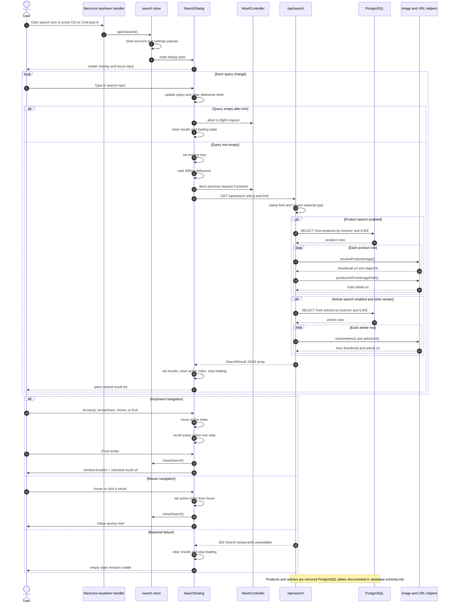

# Search

Validated against:

- `src/shared/layouts/NavIcons.astro`
- `src/features/search/store.ts`
- `src/features/search/components/SearchDialog.tsx`
- `src/pages/api/search.ts`
- `src/core/article-helpers.ts`
- `src/core/seo/url-contract.ts`

## Traceability

| Layer | Artifacts |
|---|---|
| Frontend map | [Search Surface](../03-architecture/routing-and-gui.md#search-surface) |
| GUI entry files | [`NavIcons.astro`](../../src/shared/layouts/NavIcons.astro), [`store.ts`](../../src/features/search/store.ts), [`SearchDialog.tsx`](../../src/features/search/components/SearchDialog.tsx) |
| Runtime route | [`/api/search`](../../src/pages/api/search.ts) |
| Data schemas | [`products`](../03-architecture/data-model.md#products), [`articles`](../03-architecture/data-model.md#articles) |
| URL builders | [`article-helpers.ts`](../../src/core/article-helpers.ts), [`url-contract.ts`](../../src/core/seo/url-contract.ts) |
| Standalone Mermaid | [search.mmd](./search.mmd) |

## Runtime surface

| Route | Role |
|---|---|
| `/api/search` | Full-text search over `products` and `articles` with thumbnail and URL derivation |

## Sequence Diagram

## Flow Notes

- Search is a nav-level overlay, so the user interaction always starts in the
  global shell rather than inside a page-specific component.
- `openSearch()` explicitly closes account and settings popups before the dialog
  opens, preventing overlapping nav overlays.
- `/api/search` is dual-source. It can query only `products`, only `articles`,
  or both, depending on the request type filter and remaining result slots.
- Result URLs are helper-generated contracts, not route-file-derived links.
  Product results map to `/hubs/...`; article results map to `/{collection}/{id}`.
