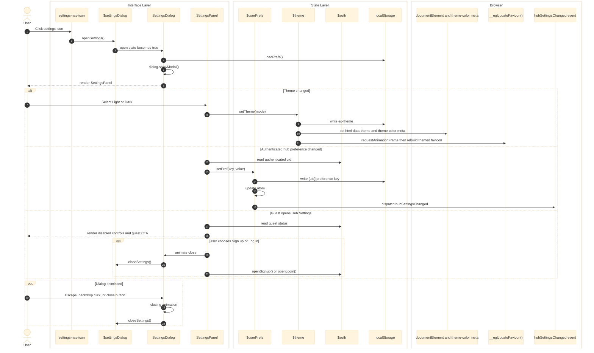

# Settings

Validated against:

- `src/shared/layouts/MainLayout.astro`
- `src/shared/layouts/NavIcons.astro`
- `src/features/settings/store.ts`
- `src/features/settings/types.ts`
- `src/features/settings/components/SettingsDialog.tsx`
- `src/features/settings/components/SettingsPanel.tsx`
- `src/features/settings/components/ToggleSwitch.tsx`
- `src/features/settings/components/RadioGroup.tsx`
- `src/features/settings/tests/settings-store.test.mjs`
- `src/features/auth/store.ts`

## Traceability

| Layer | Artifacts |
|---|---|
| Frontend map | [Settings Surface](../03-architecture/routing-and-gui.md#settings-surface) |
| Related docs | [Routing and GUI](../03-architecture/routing-and-gui.md), [Light Theme](../08-design-system/light-theme.md) |
| Adjacent features | [Auth](./auth.md) |
| Standalone Mermaid | [settings.mmd](./settings.mmd) |

## Responsibilities

- Open and close the native settings `<dialog>` from the shared nav shell.
- Persist device-level theme selection in `localStorage`.
- Persist uid-scoped hub preferences in `localStorage`.
- Keep theme, `<html data-theme>`, `<meta name="theme-color">`, and the dynamic
  favicon in sync.
- Gate hub-preference editing for guests while still allowing theme changes.

## Runtime Surface

| Surface | Role |
|---|---|
| `settings-nav-icon` in `NavIcons.astro` | Primary user-visible entry point |
| `SettingsDialog.tsx` | Native `<dialog>` shell with `showModal()` and backdrop-close handling |
| `SettingsPanel.tsx` | Theme toggle, guest CTA, and hub-preference controls |
| `settings/store.ts` | Nano Store state, `localStorage` reads and writes, DOM updates |

No server route or database-backed settings persistence was verified in this
snapshot. `pushPrefs()` is present as a stub and does not perform network sync.

## Sequence Diagram

## State Transitions

- `MainLayout.astro` calls `loadTheme()` and `loadPrefs()` during client boot.
- Theme state is device-level and stored under `eg-theme`.
- Hub preferences are uid-scoped through `prefsStorageKey(uid, key)`.
- `ThemeMode` maps `light -> default` and `dark -> gaming` to match the live
  `data-theme` values used by the shell CSS.

## Error Paths and Boundaries

- If `localStorage` is unavailable, the store guards return early and the dialog
  behaves as a no-op persistence layer rather than throwing.
- Guest users can view Hub Settings but cannot mutate the locked controls.
- There is no verified server sync for settings in this snapshot; device and
  uid-scoped `localStorage` is the only active persistence boundary.
