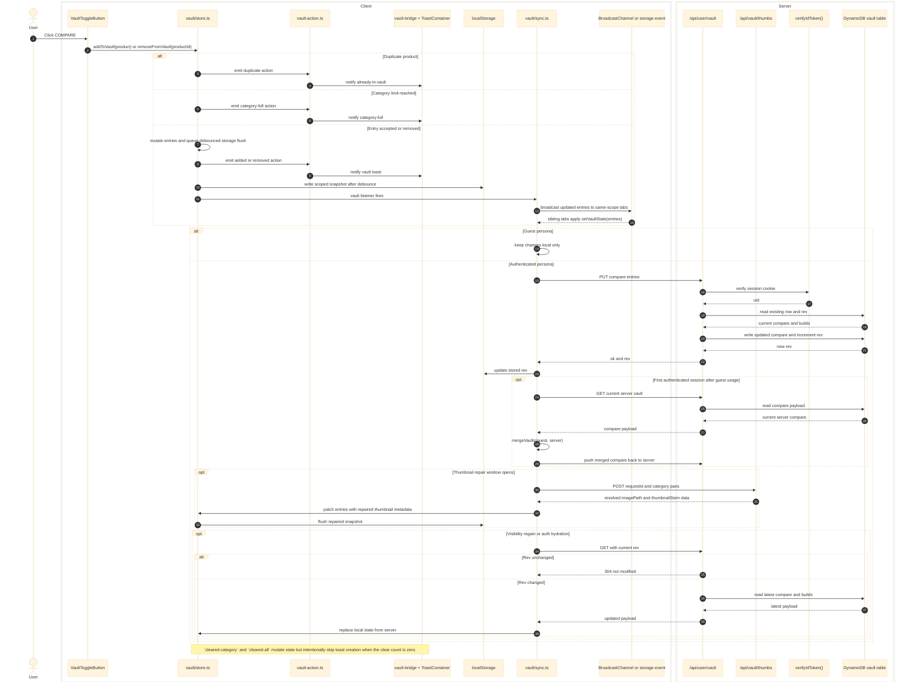

# Vault

Validated against:

- `src/shared/layouts/MainLayout.astro`
- `src/shared/layouts/NavLinks.astro`
- `src/shared/layouts/NavIcons.astro`
- `src/features/vault/components/VaultToggleButton.tsx`
- `src/features/vault/components/VaultDropdown.tsx`
- `src/features/vault/components/VaultCount.tsx`
- `src/features/vault/store.ts`
- `src/features/vault/sync.ts`
- `src/features/vault/merge.ts`
- `src/features/vault/thumbs.ts`
- `src/features/vault/vault-action.ts`
- `src/features/notifications/vault-bridge.mjs`
- `src/features/notifications/components/ToastContainer.tsx`
- `src/features/notifications/components/VaultToast.tsx`
- `src/pages/api/user/vault.ts`
- `src/pages/api/vault/thumbs.ts`
- `src/features/vault/server/db.ts`
- `src/features/vault/server/schema.ts`

## Traceability

| Layer | Artifacts |
|---|---|
| Frontend map | [Vault Surface](../03-architecture/routing-and-gui.md#vault-surface), [Catalog Surface](../03-architecture/routing-and-gui.md#catalog-surface) |
| Related runtime docs | [System Map](../03-architecture/system-map.md), [Database Schema](../03-architecture/data-model.md#dynamodb-vault-store), [Environment and Config](../02-dependencies/environment-and-config.md) |
| Adjacent features | [Auth](./auth.md), [Catalog](./catalog.md), [Notifications](./notifications.md) |
| Standalone Mermaid | [vault.mmd](./vault.mmd) |

## Responsibilities

- Hold compare entries in a local Nano Store for guest and signed-in personas.
- Persist guest and signed-in snapshots to scoped `localStorage`.
- Merge guest state into the authenticated persona on first login.
- Sync authenticated compare state to DynamoDB through `/api/user/vault`.
- Repair stale thumbnail metadata through `/api/vault/thumbs`.
- Convert vault mutations into toast notifications through the notifications bridge.

## Runtime Surface

| Surface | Role |
|---|---|
| `VaultToggleButton.tsx` | User-facing add and remove entry point mounted on product cards |
| `VaultDropdown.tsx` | Global shell compare surface rendered inside the vault mega menu |
| `VaultCount.tsx` | Live count badge in the nav shell |
| `/api/user/vault` | Authenticated read and write API for compare persistence and revision checks |
| `/api/vault/thumbs` | Thumbnail normalization API backed by the product registry, not DynamoDB |

## Sequence Diagram

## State Transitions

- Persona starts as `guest` until auth changes to an authenticated `uid`.
- `switchPersona()` swaps the storage namespace before the store is rehydrated.
- First-login detection uses the `eg_first=1` cookie set during auth flow, then
  merges guest and server compare lists before the first authenticated push.
- `rev` is stored per `uid` and used to short-circuit server pulls with `304`.
- Thumbnail refresh timestamps are stored per scope so guest and authenticated
  vault snapshots can age independently.

## Error Paths and Side Effects

- Duplicate adds and category-limit violations emit actions and toasts without
  mutating the stored entries.
- Unauthorized responses suspend server sync but keep the local vault snapshot.
- Network or schema failures during `/api/vault/thumbs` leave the existing
  snapshot intact.
- `VaultToast` still has a client-side `tryImageFallback()` path if the repaired
  image URL fails at render time.
- Toasts currently exist only for add, remove, duplicate, and category-full.
  Empty clear operations intentionally produce no toast. The queue and dismiss
  lifecycle are documented separately in [notifications.md](./notifications.md).
