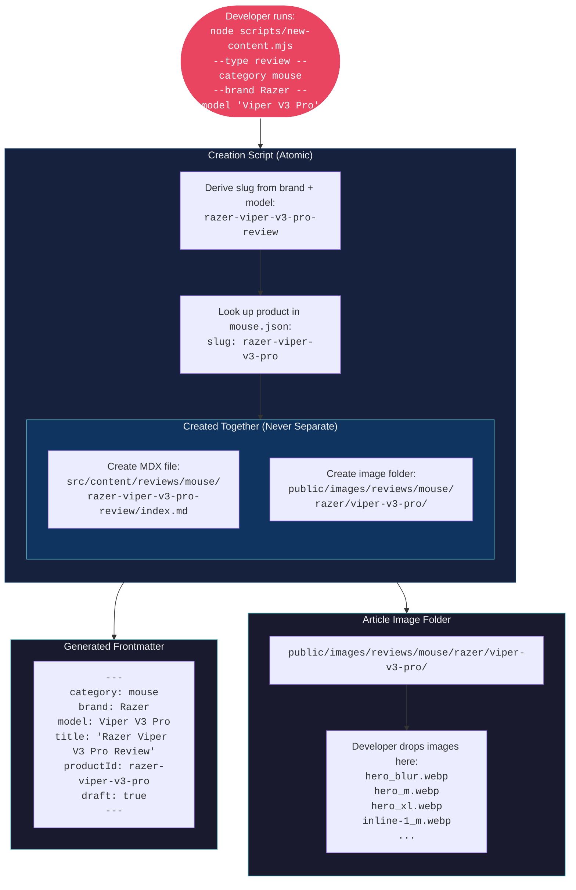
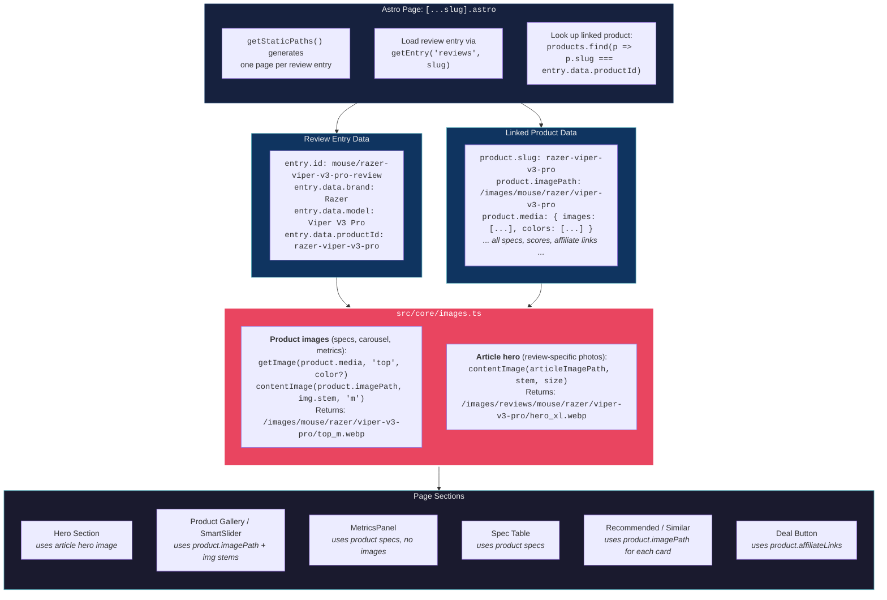
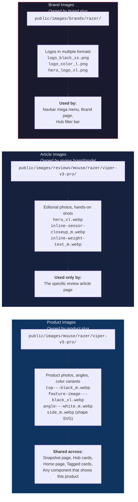
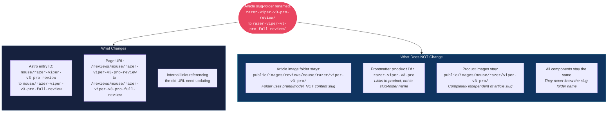
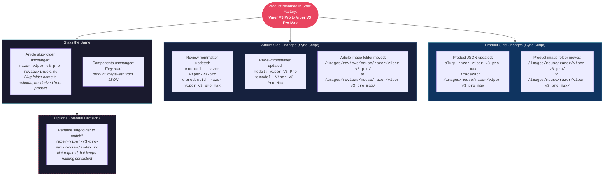
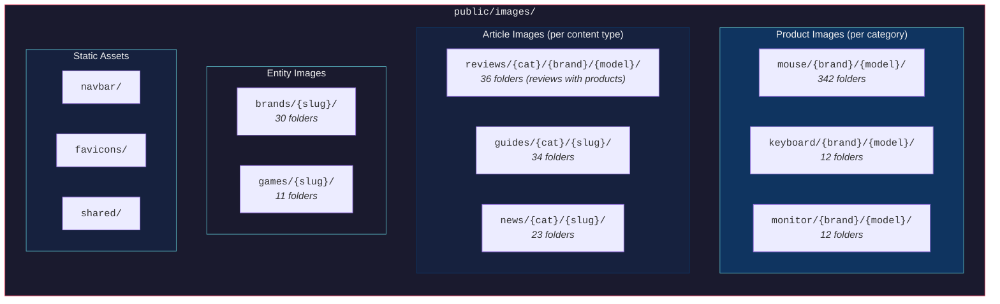

# Article Identity Flow

> How articles (reviews, guides, news) are created, how they link to products and images, and what happens when filenames or product references change.

## New Article Creation

## How Components Resolve Article + Product Images

## Two Separate Image Domains

## Article Filename Rename

## Product Rename Affecting Articles

## Content Type Image Folder Map

