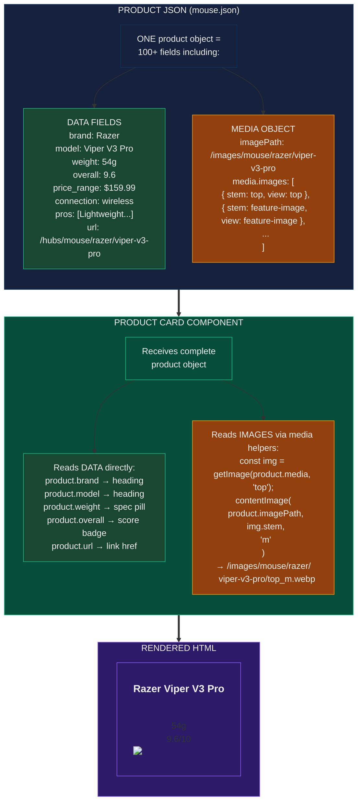
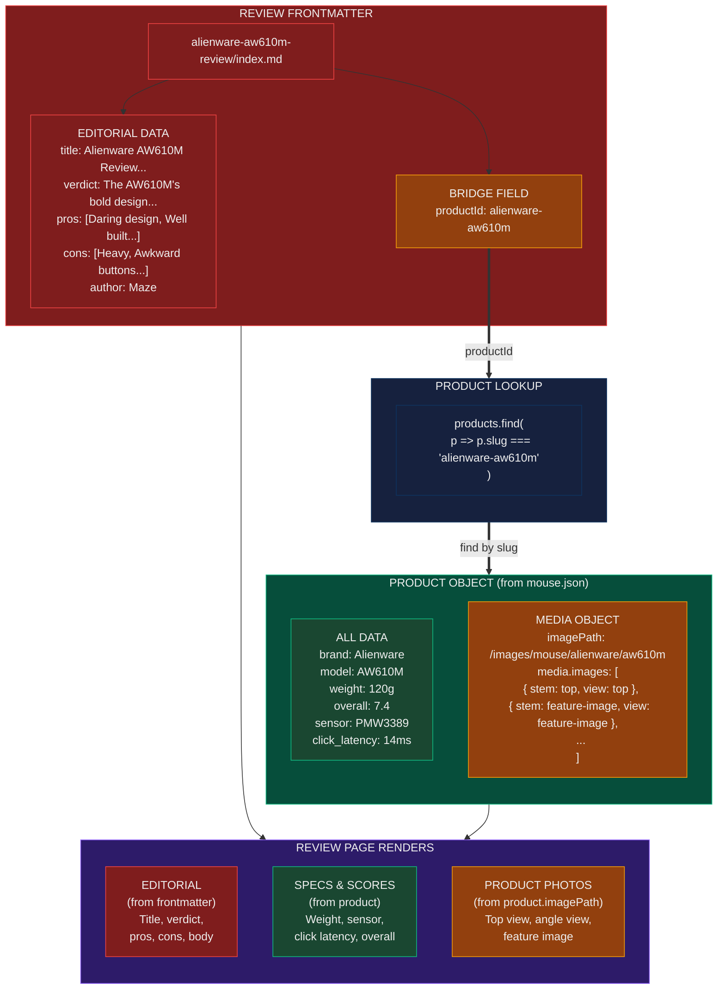
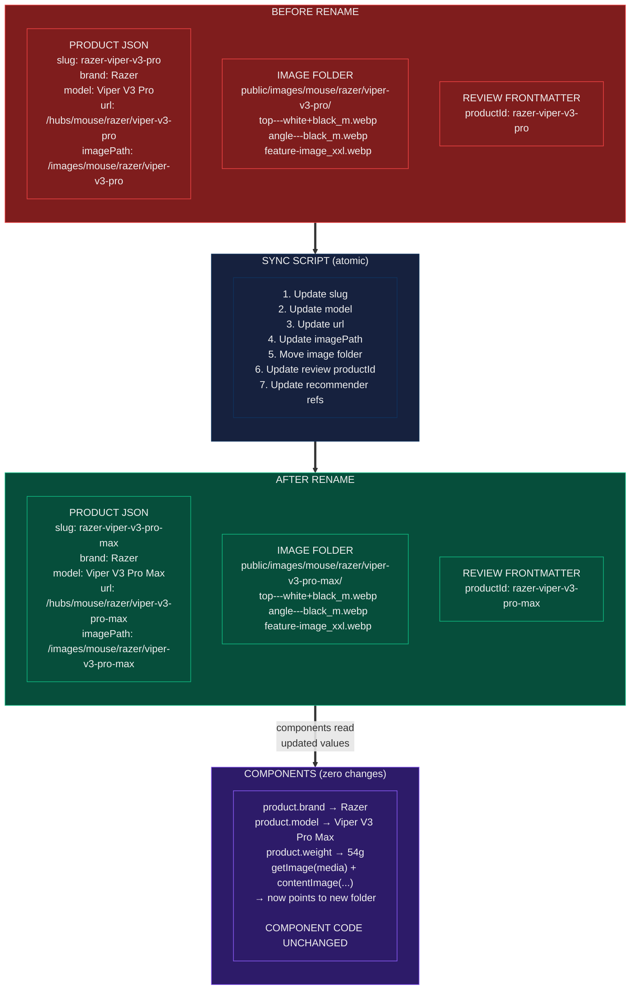
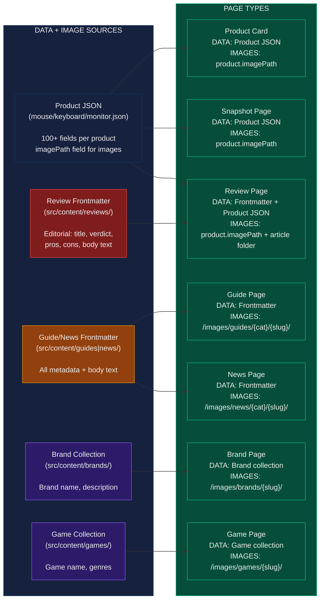

# Dual Source of Truth — Data & Image Diagrams

> These diagrams show how ONE product object provides BOTH data and images to components,
> and how the system stays consistent when products or articles are renamed.

---

## Diagram 1: Product Card — One Object, Both Data and Images

Shows how a single product JSON entry feeds both display data AND image URLs to a component.

---

## Diagram 2: Review Page — Two Sources Merge

Shows how a review page loads editorial content from frontmatter AND hardware data + images from the product JSON.

---

## Diagram 3: Rename — Both Data and Images Update Atomically

Shows what the sync script changes when a product is renamed. Both data fields AND image paths update in one atomic operation.

---

## Diagram 4: All Content Types — Where Data and Images Come From

Shows the data and image source for every content type in the system.

