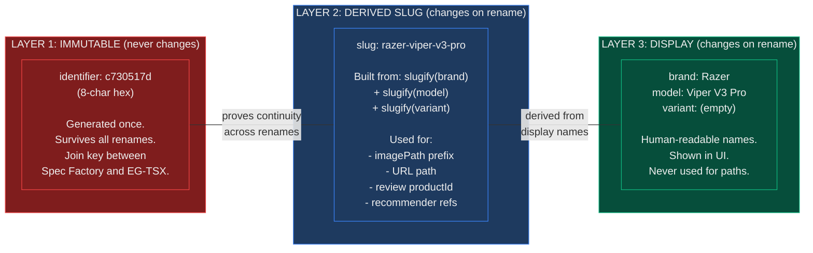
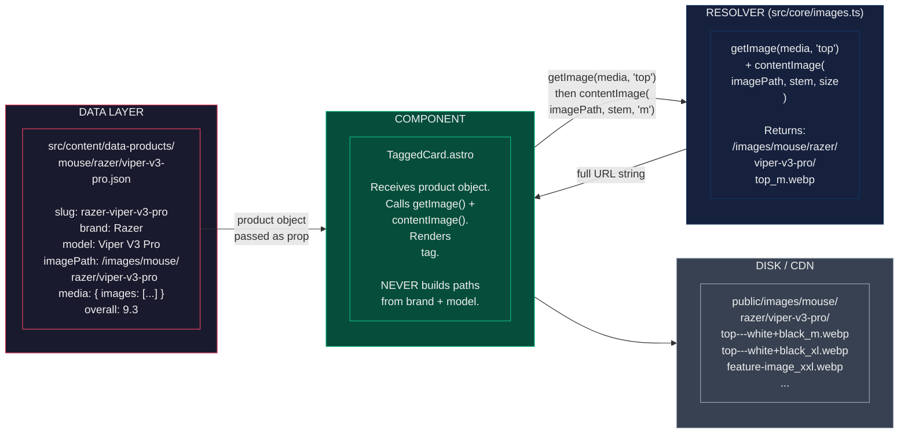

# Product Identity Flow

> How products are created, how components consume them, and what happens when brand/model/variant change.

## New Product Creation

```mermaid
flowchart TB
  subgraph SF["SPEC FACTORY (Source of Truth)"]
    direction TB
    SF1["Developer adds product\nin Spec Factory GUI"]
    SF2["Identity Gate validates\nbrand + model + variant\n(no duplicates)"]
    SF3["Generate immutable identifier\n(8-char hex, e.g. c730517d)"]
    SF4["Build productId slug\ncategory-brand-model-variant\ne.g. mouse-razer-viper-v3-pro"]
    SF5["Write to product_catalog.json\n+ brand_registry.json"]
    SF1 --> SF2 --> SF3 --> SF4 --> SF5
  end

  subgraph SYNC["SYNC BRIDGE (scripts/)"]
    direction TB
    SY1["Export script reads\nSpec Factory catalogs"]
    SY2["Generate EG-TSX product entry:\n  slug: razer-viper-v3-pro\n  brand: Razer\n  model: Viper V3 Pro\n  imagePath: /images/mouse/razer/viper-v3-pro\n  url: /hubs/mouse/razer/viper-v3-pro\n  identifier: c730517d"]
    SY3["Write to\nsrc/content/data-products/\nmouse/{brand}/{slug}.json"]
    SY4["Create image folder\npublic/images/mouse/razer/viper-v3-pro/"]
    SY1 --> SY2 --> SY3 --> SY4
  end

  subgraph TSX["EG-TSX (Consumer)"]
    direction TB
    TX1["Astro build reads\nproduct JSON files"]
    TX2["Component receives\nproduct object with\nimagePath + media"]
    TX3["Calls getImage(product.media, 'top')\nthen contentImage(\nproduct.imagePath,\nimg.stem, 'm')"]
    TX4["Resolver returns\n/images/mouse/razer/\nviper-v3-pro/\ntop_m.webp"]
    TX5["Image renders\nin browser"]
    TX1 --> TX2 --> TX3 --> TX4 --> TX5
  end

  SF5 ==>|"Spec Factory\nexport"| SY1
  SY4 ==>|"Files ready\non disk"| TX1

  style SF fill:#1a1a2e,stroke:#e94560,color:#eee
  style SYNC fill:#16213e,stroke:#0f3460,color:#eee
  style TSX fill:#0f3460,stroke:#53a8b6,color:#eee
  style SF1 fill:#1a1a2e,stroke:#e94560,color:#eee
  style SF2 fill:#1a1a2e,stroke:#e94560,color:#eee
  style SF3 fill:#1a1a2e,stroke:#e94560,color:#eee
  style SF4 fill:#1a1a2e,stroke:#e94560,color:#eee
  style SF5 fill:#1a1a2e,stroke:#e94560,color:#eee
  style SY1 fill:#16213e,stroke:#0f3460,color:#eee
  style SY2 fill:#16213e,stroke:#0f3460,color:#eee
  style SY3 fill:#16213e,stroke:#0f3460,color:#eee
  style SY4 fill:#16213e,stroke:#0f3460,color:#eee
  style TX1 fill:#0f3460,stroke:#53a8b6,color:#eee
  style TX2 fill:#0f3460,stroke:#53a8b6,color:#eee
  style TX3 fill:#0f3460,stroke:#53a8b6,color:#eee
  style TX4 fill:#0f3460,stroke:#53a8b6,color:#eee
  style TX5 fill:#0f3460,stroke:#53a8b6,color:#eee
```

## Product Rename Flow (Brand, Model, or Variant Change)

```mermaid
flowchart TB
  subgraph TRIGGER["RENAME TRIGGER"]
    direction TB
    T1["Brand changes:\nSteelSeries -> GG by SteelSeries\n\nOR Model changes:\nViper V3 Pro -> Viper V3 Pro Max\n\nOR Variant added:\n(none) -> Wireless"]
  end

  subgraph SF["SPEC FACTORY CASCADE"]
    direction TB
    R1["Detect name change\n(API or GUI edit)"]
    R2["Rebuild slug:\nmouse-razer-viper-v3-pro\n->\nmouse-razer-viper-v3-pro-max"]
    R3["Preserve identifier\nc730517d (never changes)"]
    R4["Move all artifact folders\nold slug path -> new slug path"]
    R5["Record in rename_log.json:\n  old_slug, new_slug,\n  identifier, timestamp"]
    R6["Add old name to aliases\n(backward lookup)"]
    R1 --> R2 --> R3 --> R4 --> R5 --> R6
  end

  subgraph SYNC["SYNC BRIDGE CASCADE"]
    direction TB
    S1["Read rename_log.json\nsince last sync"]
    S2["For each rename, find\nproduct by identifier\n(stable across renames)"]
    S3["Update product JSON:\n  slug: razer-viper-v3-pro-max\n  model: Viper V3 Pro Max\n  imagePath: /images/.../viper-v3-pro-max\n  url: /hubs/.../viper-v3-pro-max"]
    S4["Move image folder:\npublic/images/mouse/razer/\n  viper-v3-pro/\n    -> viper-v3-pro-max/"]
    S5["Rewrite review frontmatter:\nproductId: razer-viper-v3-pro\n  -> razer-viper-v3-pro-max"]
    S6["Rewrite recommender refs:\nsimilar/recommended arrays"]
    S1 --> S2 --> S3 --> S4 --> S5 --> S6
  end

  subgraph COMPONENTS["COMPONENTS (zero changes needed)"]
    direction TB
    C1["TaggedCard reads\nproduct.imagePath\n(now has new value)"]
    C2["Calls getImage(media, 'top')\nthen contentImage(\nimagePath, stem, 'm')"]
    C3["Returns new URL:\n/images/mouse/razer/\nviper-v3-pro-max/\ntop---white+black_m.webp"]
    C4["Review page reads\nproductId from frontmatter\n(now razer-viper-v3-pro-max)"]
    C5["Looks up product,\ngets new imagePath,\nrenders correctly"]
    C1 --> C2 --> C3
    C4 --> C5
  end

  TRIGGER ==> SF
  SF ==>|"rename_log.json"| SYNC
  SYNC ==>|"JSON + folders\nupdated on disk"| COMPONENTS

  style TRIGGER fill:#2d1b69,stroke:#8b5cf6,color:#eee
  style SF fill:#1a1a2e,stroke:#e94560,color:#eee
  style SYNC fill:#16213e,stroke:#0f3460,color:#eee
  style COMPONENTS fill:#064e3b,stroke:#10b981,color:#eee
  style T1 fill:#2d1b69,stroke:#8b5cf6,color:#eee
  style R1 fill:#1a1a2e,stroke:#e94560,color:#eee
  style R2 fill:#1a1a2e,stroke:#e94560,color:#eee
  style R3 fill:#1a1a2e,stroke:#e94560,color:#eee
  style R4 fill:#1a1a2e,stroke:#e94560,color:#eee
  style R5 fill:#1a1a2e,stroke:#e94560,color:#eee
  style R6 fill:#1a1a2e,stroke:#e94560,color:#eee
  style S1 fill:#16213e,stroke:#0f3460,color:#eee
  style S2 fill:#16213e,stroke:#0f3460,color:#eee
  style S3 fill:#16213e,stroke:#0f3460,color:#eee
  style S4 fill:#16213e,stroke:#0f3460,color:#eee
  style S5 fill:#16213e,stroke:#0f3460,color:#eee
  style S6 fill:#16213e,stroke:#0f3460,color:#eee
  style C1 fill:#064e3b,stroke:#10b981,color:#eee
  style C2 fill:#064e3b,stroke:#10b981,color:#eee
  style C3 fill:#064e3b,stroke:#10b981,color:#eee
  style C4 fill:#064e3b,stroke:#10b981,color:#eee
  style C5 fill:#064e3b,stroke:#10b981,color:#eee
```

## The Three Identity Layers

## Component Data Flow (How a Product Card Renders)

## Brand Rename Cascade (Full Impact)

```mermaid
flowchart TB
  RENAME["Brand rename:\nSteelSeries -> GG by SteelSeries"]

  subgraph BRAND["BRAND CHANGES"]
    B1["Brand registry:\n  old slug: steelseries\n  new slug: gg-by-steelseries\n  identifier: 6f1f6e73 (unchanged)"]
    B2["Brand content file:\n  steelseries.md -> gg-by-steelseries.md"]
    B3["Brand images:\n  /images/brands/steelseries/\n    -> /images/brands/gg-by-steelseries/"]
  end

  subgraph PRODUCTS["ALL PRODUCTS OF THIS BRAND"]
    P1["Product slugs rebuilt:\n  steelseries-apex-pro-gen-3\n    -> gg-by-steelseries-apex-pro-gen-3"]
    P2["Product imagePaths rebuilt:\n  /images/keyboard/steelseries/apex-pro-gen-3\n    -> /images/keyboard/gg-by-steelseries/apex-pro-gen-3"]
    P3["Product image folders moved:\n  public/images/keyboard/steelseries/\n    -> public/images/keyboard/gg-by-steelseries/"]
    P4["Product URLs rebuilt:\n  /hubs/keyboard/steelseries/apex-pro-gen-3\n    -> /hubs/keyboard/gg-by-steelseries/apex-pro-gen-3"]
  end

  subgraph REVIEWS["ALL REVIEWS OF THESE PRODUCTS"]
    RV1["Review frontmatter updated:\n  productId: steelseries-apex-pro-gen-3\n    -> gg-by-steelseries-apex-pro-gen-3"]
    RV2["Review brand field updated:\n  brand: SteelSeries\n    -> brand: GG by SteelSeries"]
  end

  subgraph REFS["ALL CROSS-REFERENCES"]
    RF1["Recommender similar[] updated"]
    RF2["Recommender recommended[] updated"]
    RF3["Hub tag links updated"]
  end

  subgraph SAFE["COMPONENTS (zero changes)"]
    S1["All components read\nimagePath from JSON.\nNew value -> new URLs.\nNo code changes needed."]
  end

  RENAME --> BRAND --> PRODUCTS --> REVIEWS --> REFS
  REFS -->|"rebuild site"| SAFE

  style RENAME fill:#7f1d1d,stroke:#ef4444,color:#eee
  style BRAND fill:#1a1a2e,stroke:#e94560,color:#eee
  style PRODUCTS fill:#16213e,stroke:#0f3460,color:#eee
  style REVIEWS fill:#2d1b69,stroke:#8b5cf6,color:#eee
  style REFS fill:#374151,stroke:#9ca3af,color:#eee
  style SAFE fill:#064e3b,stroke:#10b981,color:#eee
  style B1 fill:#1a1a2e,stroke:#e94560,color:#eee
  style B2 fill:#1a1a2e,stroke:#e94560,color:#eee
  style B3 fill:#1a1a2e,stroke:#e94560,color:#eee
  style P1 fill:#16213e,stroke:#0f3460,color:#eee
  style P2 fill:#16213e,stroke:#0f3460,color:#eee
  style P3 fill:#16213e,stroke:#0f3460,color:#eee
  style P4 fill:#16213e,stroke:#0f3460,color:#eee
  style RV1 fill:#2d1b69,stroke:#8b5cf6,color:#eee
  style RV2 fill:#2d1b69,stroke:#8b5cf6,color:#eee
  style RF1 fill:#374151,stroke:#9ca3af,color:#eee
  style RF2 fill:#374151,stroke:#9ca3af,color:#eee
  style RF3 fill:#374151,stroke:#9ca3af,color:#eee
  style S1 fill:#064e3b,stroke:#10b981,color:#eee
```

