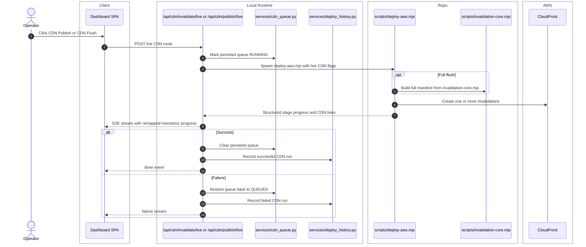

# CDN Actions

## Scope

The dashboard exposes two CDN execution paths:

- `CDN Publish` - replay queued or explicit smart paths
- `CDN Flush` - execute the full invalidation manifest

The legacy JSON route `POST /api/cdn/invalidate` still exists, but the UI uses the live SSE routes.

## Verified Flow

%%{init: {'theme': 'base', 'themeVariables': { 'fontSize': '20px', 'actorWidth': 250, 'actorMargin': 200, 'boxMargin': 20 }}}%%

## Current Route Contract

| Route | Behavior | Backing flags |
| --- | --- | --- |
| `/api/cdn/publish/live` | Requires explicit paths in the request body; uses smart mode | `--skip-build --skip-stack --skip-static --invalidation-mode smart --invalidate-path ...` |
| `/api/cdn/invalidate/live` | Full manifest flush driven by the deploy script | `--skip-build --skip-stack --skip-static --static-scope site --invalidation-mode full` |
| `/api/cdn/invalidate` | Direct AWS CLI `create-invalidation --paths /*`; JSON only | not used by the main UI flow |

## Progress And Error Semantics

- `app/routers/cdn.py` remaps manual flush progress so preflight stays in roughly `0-12` and invalidation progress occupies the remainder of the lane.
- Preformatted SSE strings from the child stream are forwarded unchanged; raw `SSELine` instances are serialized by the route.
- If CloudFront invalidation creation succeeds but `GetInvalidation` polling lacks permission, the deploy script can degrade the result to `UNVERIFIED` instead of failing the whole action.
- Missing `DEPLOY_CLOUDFRONT_ID` produces HTTP `400` before the child process starts.

## Side Effects

- Success clears persisted queue state and adds a `kind="cdn"` history entry.
- Failure preserves queue entries for replay.
- The CDN tab tracks planned paths, grouped invalidations, invalidation ids, live path resolution states, and last error metadata.

## Cross-Links

- Queued path producers: [split-static-publishes-and-cdn-queue.md](split-static-publishes-and-cdn-queue.md)
- GUI lane and metrics: [../interface/routing-and-gui.md](../interface/routing-and-gui.md)
- Topology: [../architecture/system-map.md](../architecture/system-map.md)
- Verification notes: [../validation/runtime-verification.md](../validation/runtime-verification.md)

## Validated Against

- `app/routers/cdn.py`
- `app/services/cdn_queue.py`
- `app/services/deploy_history.py`
- `ui/dashboard.jsx`
- `ui/cdn-path-status.ts`
- `ui/invalidation-paths.js`
- `ui/site-stage-progress.ts`
- `../../scripts/deploy-aws.mjs`
- `../../scripts/invalidation-core.mjs`
