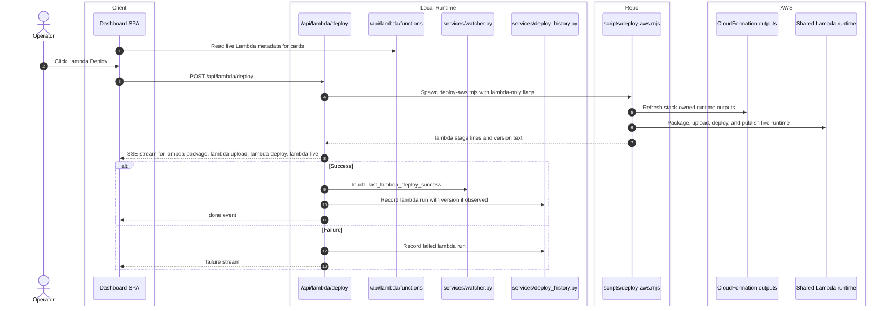

# Lambda Deploy

## Scope

This feature covers the Lambda-only deploy button and the Lambda command center panels.

## Verified Flow

%%{init: {'theme': 'base', 'themeVariables': { 'fontSize': '20px', 'actorWidth': 250, 'actorMargin': 200, 'boxMargin': 20 }}}%%

## Current Contract

- The route is serialized behind its own async lock. Concurrent Lambda deploys return HTTP `409`.
- `app/routers/lambda_deploy.py` runs `scripts/deploy-aws.mjs` with `--skip-build --skip-static --skip-invalidate`.
- The route parses version text from stream lines containing `v<number>` and stores that in deploy history when possible.
- `app/routers/lambda_catalog.py` reads the current stack outputs and then asks AWS for the live Lambda function configuration so the dashboard cards reflect deployed metadata, not hard-coded placeholders.

## Error Paths

- A non-zero child exit records a failed history entry and ends the stream without a `done` event.
- Missing or broken AWS access can also degrade the Lambda catalog cards because the metadata route depends on live AWS calls.

## Side Effects

- Successful runs touch only the Lambda marker, not the site/data/image markers.
- The Lambda command center uses both watcher state and live AWS function metadata.
- The dashboard explicitly states that Lambda deploy does not invalidate the site CDN.

## Cross-Links

- Infra and watcher panels: [operator-observability.md](operator-observability.md)
- Runtime topology: [../architecture/system-map.md](../architecture/system-map.md)
- Config inputs: [../runtime/environment-and-config.md](../runtime/environment-and-config.md)
- GUI map: [../interface/routing-and-gui.md](../interface/routing-and-gui.md)

## Validated Against

- `app/routers/lambda_catalog.py`
- `app/routers/lambda_deploy.py`
- `app/services/deploy_history.py`
- `app/services/watcher.py`
- `ui/dashboard.jsx`
- `../../scripts/deploy-aws.mjs`
- `../../infrastructure/aws/eg-tsx-stack.yaml`
