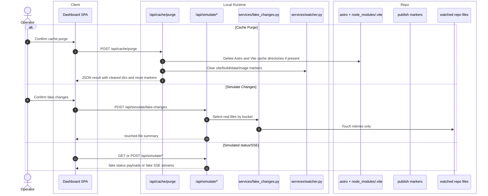

# Maintenance And Simulation

## Scope

This feature groups the local maintenance and diagnostic actions that are operator-facing but are not part of the live deploy pipeline:

- Cache Purge
- Simulate Changes
- Mounted `/api/simulate/*` status and SSE routes

## Verified Flow

%%{init: {'theme': 'base', 'themeVariables': { 'fontSize': '20px', 'actorWidth': 250, 'actorMargin': 200, 'boxMargin': 20 }}}%%

## Current Contract

- `app/routers/cache.py` deletes only the configured Astro and Vite cache directories, then clears site/build/data/image marker files through `clear_site_publish_markers`.
- `services/fake_changes.py` updates mtimes only. It does not mutate file contents.
- Fake changes are bucketed across images, content, data, CSS, JavaScript, and TypeScript roots.
- The fake-change service resolves the touch timestamp to at least one second beyond the newest relevant marker so the watcher treats the touched files as pending immediately after a publish.
- `app/routers/simulate.py` exposes mock status routes, build/lambda/CDN SSE scenarios, cache-purge mocks, and the real fake-change action.

## Error And Safety Notes

- Cache purge can fail with HTTP `500` on filesystem errors.
- Simulate Changes prompts in the UI before touching files because it updates real mtimes inside the repo.
- The simulate router comment says the routes are dev-only, but they are mounted in `app/main.py` and therefore part of the current dashboard process.

## Cross-Links

- GUI entrypoints: [../interface/routing-and-gui.md](../interface/routing-and-gui.md)
- Marker ownership: [../data/database-schema.md](../data/database-schema.md)
- Verification context: [../validation/runtime-verification.md](../validation/runtime-verification.md)

## Validated Against

- `app/main.py`
- `app/routers/cache.py`
- `app/routers/simulate.py`
- `app/services/fake_changes.py`
- `app/services/watcher.py`
- `ui/dashboard.jsx`
