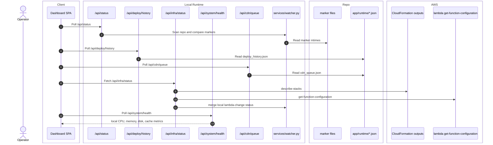

# Operator Observability

## Scope

This feature covers the passive status surfaces that keep operators aware of local and remote state:

- pending files and scope counts
- deploy history
- infra dependencies
- live Lambda catalog
- server health
- CDN queue summary

## Verified Flow

%%{init: {'theme': 'base', 'themeVariables': { 'fontSize': '20px', 'actorWidth': 250, 'actorMargin': 200, 'boxMargin': 20 }}}%%

## Current Contract

- `/api/status` returns both the legacy site-wide pending view and the newer scoped fields: `buildFiles`, `lambdaFiles`, upload counts, and DB sync counts.
- Summary polling truncates file arrays to 50 entries. `refreshStatus(true)` switches to `?summary=false` when the UI wants the full list.
- `/api/infra/status` merges three sources: config, CloudFormation outputs, and live Lambda metadata. It also derives watched Lambda folders from `services/watcher.py` category prefixes instead of a six-entry hard-coded list.
- `/api/system/health` uses native Win32 CPU sampling plus filesystem/disk inspection. It does not shell out to PowerShell for CPU.
- `/api/deploy/history` and `/api/cdn/queue` are backed by persisted JSON files so they survive dashboard restarts.

## Error Paths And Degradation

- If stack outputs cannot be resolved, infra status still returns config fallbacks and an `error` string.
- If live Lambda lookup fails, infra status can still show the stack output name as a warning fallback.
- Status polling can show truncated file lists during active polling; full detail requires the full-list request path.

## Cross-Links

- GUI ownership: [../interface/routing-and-gui.md](../interface/routing-and-gui.md)
- Marker and persisted state details: [../data/database-schema.md](../data/database-schema.md)
- Lambda deploy flow: [lambda-deploy.md](lambda-deploy.md)
- CDN queue producers and consumers: [split-static-publishes-and-cdn-queue.md](split-static-publishes-and-cdn-queue.md), [cdn-actions.md](cdn-actions.md)

## Validated Against

- `app/routers/deploy_history.py`
- `app/routers/infra_status.py`
- `app/routers/lambda_catalog.py`
- `app/routers/status.py`
- `app/routers/system_health.py`
- `app/services/cdn_queue.py`
- `app/services/deploy_history.py`
- `app/services/system_health.py`
- `app/services/watcher.py`
- `ui/dashboard.jsx`
