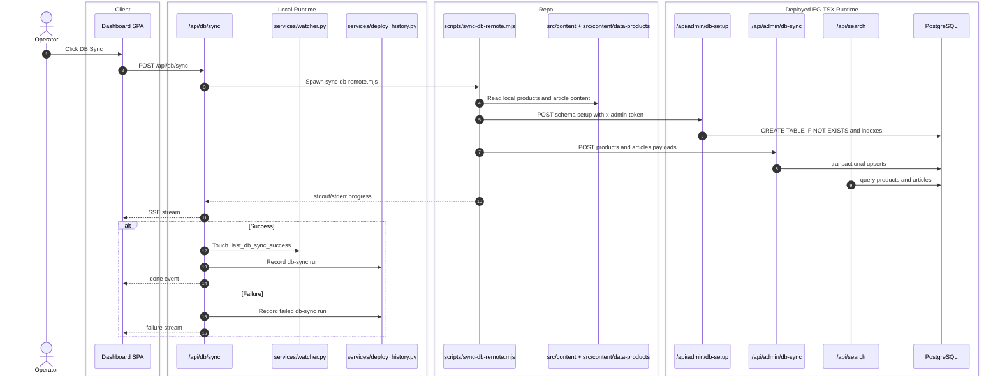

# Search DB Sync

## Scope

This feature syncs local searchable content into the deployed PostgreSQL database that backs `/api/search`.

## Verified Flow

%%{init: {'theme': 'base', 'themeVariables': { 'fontSize': '20px', 'actorWidth': 250, 'actorMargin': 200, 'boxMargin': 20 }}}%%

## Current Contract

- `app/routers/db_sync.py` is protected by its own async lock, so overlapping DB syncs return HTTP `409`.
- The route derives the target base URL from `DEPLOY_COGNITO_CALLBACK_URL` when no explicit `--url` override is passed through the script.
- `scripts/sync-db-remote.mjs` uses `eg-setup-2026` as the default token unless `--token` or `ADMIN_TOKEN` overrides it.
- The deployed admin routes upsert products and articles into PostgreSQL, and the deployed search API then queries only those tables.

## Data Boundaries

- Canonical source of truth for searchable content remains the repo files.
- Canonical runtime search store is PostgreSQL after sync.
- The dashboard tracks pending DB sync work from watcher categories `product`, `review`, `guide`, `news`, `brand`, and `game`.

## Error Paths

- If `DEPLOY_COGNITO_CALLBACK_URL` is missing and no explicit `--url` is provided, the script exits with an error before any HTTP call.
- Unauthorized or invalid JSON at the deployed admin routes becomes a failed sync run in the dashboard.
- The setup and upsert routes are separate. Table creation can succeed while the later upsert call fails.

## Cross-Links

- Schema details: [../data/database-schema.md](../data/database-schema.md)
- Env and token inputs: [../runtime/environment-and-config.md](../runtime/environment-and-config.md)
- GUI ownership: [../interface/routing-and-gui.md](../interface/routing-and-gui.md)
- Observability panels: [operator-observability.md](operator-observability.md)

## Validated Against

- `app/routers/db_sync.py`
- `app/services/deploy_history.py`
- `app/services/watcher.py`
- `ui/dashboard.jsx`
- `../../scripts/sync-db-remote.mjs`
- `../../src/core/db.ts`
- `../../src/pages/api/admin/db-setup.ts`
- `../../src/pages/api/admin/db-sync.ts`
- `../../src/pages/api/search.ts`
- `../../scripts/schema.sql`
