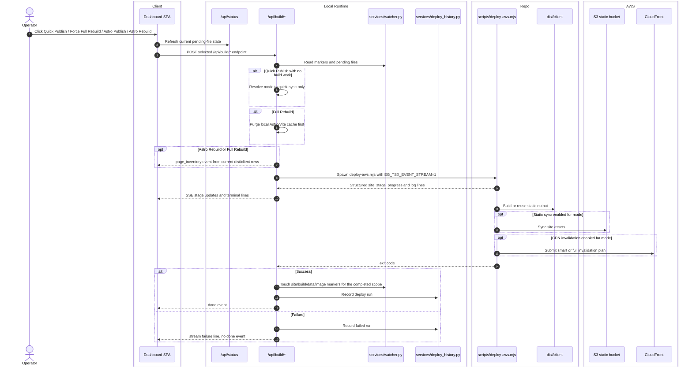

# Site Publish And Rebuild

## Scope

This feature covers the four site-scoped actions that build the site pipeline rather than the Lambda-only or DB-only flows:

- Quick Publish
- Force Full Rebuild
- Astro Publish
- Astro Rebuild

## Verified Flow

%%{init: {'theme': 'base', 'themeVariables': { 'fontSize': '20px', 'actorWidth': 250, 'actorMargin': 200, 'boxMargin': 20 }}}%%

## Mode Contract

| Action | Effective deploy args | Static sync | CDN | Marker touch on success |
| --- | --- | --- | --- | --- |
| Quick Publish | `--skip-stack --static-scope site --sync-mode quick --invalidation-mode smart` or `--skip-build` variant | yes | smart | site + build + data + image |
| Force Full Rebuild | `--skip-stack --static-scope site --sync-mode full --invalidation-mode full` after cache purge | yes | full | site + build + data + image |
| Astro Publish | `--skip-stack --skip-static --skip-invalidate --sync-mode quick` | no | no | build |
| Astro Rebuild | `--skip-stack --skip-static --skip-invalidate` | no | no | build |

## State Transitions

- `quick` can become `quick-sync-only` when the watcher shows no pending build work but still shows pending uploads.
- `full` and `astro-rebuild` emit `page_inventory` rows from `dist/client/**/index.html` so the matrix tab has a verified route list.
- Structured JSON events from `deploy-aws.mjs` are mapped into the dashboard stage lanes, while raw stdout/stderr still stream into the terminal and tab-specific panes.

## Error Paths

- Concurrent site runs are rejected with HTTP `409`.
- Any non-zero child process exit becomes `FAILED with exit code ...` in the stream and records a failed history entry.
- Full rebuild can fail before the Node deploy script if cache purge raises an OS error.
- Cached publish modes can short-circuit with a `done` event when nothing relevant is pending.

## Side Effects

- Successful site-scoped runs record counts for pages built, uploaded objects, deleted objects, and observed CDN paths.
- Marker files are touched only for scopes that actually completed.
- Deploy history is persisted in `app/runtime/deploy_history.json`.

## Cross-Links

- GUI entrypoints: [../interface/routing-and-gui.md](../interface/routing-and-gui.md)
- Runtime topology: [../architecture/system-map.md](../architecture/system-map.md)
- Config inputs: [../runtime/environment-and-config.md](../runtime/environment-and-config.md)
- Split publish queue flow: [split-static-publishes-and-cdn-queue.md](split-static-publishes-and-cdn-queue.md)

## Validated Against

- `app/routers/build.py`
- `app/routers/cache.py`
- `app/services/deploy_history.py`
- `app/services/watcher.py`
- `ui/dashboard.jsx`
- `../../scripts/deploy-aws.mjs`
- `../../scripts/invalidation-core.mjs`
