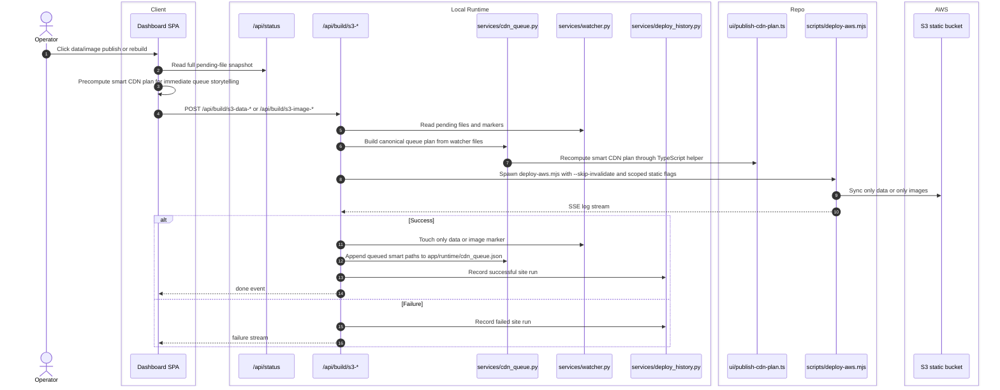

# Split Static Publishes And CDN Queue

## Scope

This feature covers the four standalone static actions:

- S3 Data Publish
- S3 Data Rebuild
- S3 Image Publish
- S3 Image Rebuild

Their distinctive behavior is that they queue smart CDN work instead of invalidating CloudFront immediately.

## Verified Flow

%%{init: {'theme': 'base', 'themeVariables': { 'fontSize': '20px', 'actorWidth': 250, 'actorMargin': 200, 'boxMargin': 20 }}}%%

## Mode Contract

| Action | Effective deploy args | Rebuild behavior | Success marker |
| --- | --- | --- | --- |
| S3 Data Publish | `--skip-build --skip-stack --skip-invalidate --static-scope data --sync-mode quick` | Upload-ready delta only | `.last_data_publish_success` |
| S3 Data Rebuild | `--skip-build --skip-stack --skip-invalidate --static-scope data --sync-mode full` | Full data-only mirror | `.last_data_publish_success` |
| S3 Image Publish | `--skip-build --skip-stack --skip-invalidate --static-scope images --sync-mode quick` | Upload-ready delta only | `.last_image_publish_success` |
| S3 Image Rebuild | `--skip-build --skip-stack --skip-invalidate --static-scope images --sync-mode full` | Full image-only mirror | `.last_image_publish_success` |

## Queue Ownership

- The UI computes an instant plan so the operator sees likely paths before the backend completes.
- The backend is authoritative. `services/cdn_queue.py` reruns the planner through `node --import tsx` and persists the resulting plan in `app/runtime/cdn_queue.json`.
- Queue entries carry `label`, `mode`, `paths`, `reason`, `sourceProfile`, `status`, and timestamps.
- Successful `CDN Publish` and `CDN Flush` clear the persisted queue. Failed CDN actions restore entries from `RUNNING` back to `QUEUED`.

## Error Paths

- Concurrent site builds still hit the shared build lock and return HTTP `409`.
- Publish variants can short-circuit with a `done` event if their scoped uploads are already clear.
- If the queue planner fails, the split publish still completes; the persisted queue entry just has no paths.

## Side Effects

- Split publishes update only their scope marker, not the full site marker set.
- The dashboard CDN queue card and detail modal are fed from persisted queue state, not browser-only memory.
- Deploy history records these runs as `kind="site"` with their scoped label.

## Cross-Links

- CDN execution flow: [cdn-actions.md](cdn-actions.md)
- Status and queue panels: [operator-observability.md](operator-observability.md)
- Data ownership and markers: [../data/database-schema.md](../data/database-schema.md)
- GUI mapping: [../interface/routing-and-gui.md](../interface/routing-and-gui.md)

## Validated Against

- `app/routers/build.py`
- `app/routers/cdn.py`
- `app/services/cdn_queue.py`
- `app/services/watcher.py`
- `ui/dashboard.jsx`
- `ui/publish-cdn-plan.ts`
- `ui/queued-cdn-state.ts`
- `../../scripts/deploy-aws.mjs`
- `../../scripts/invalidation-core.mjs`
